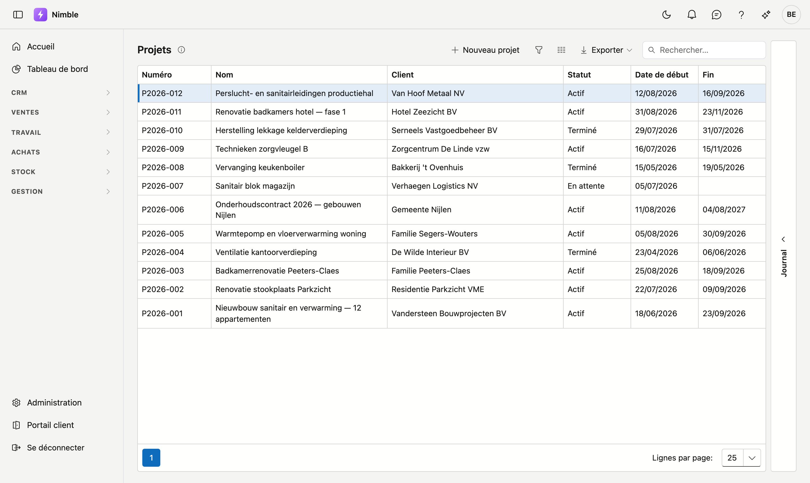
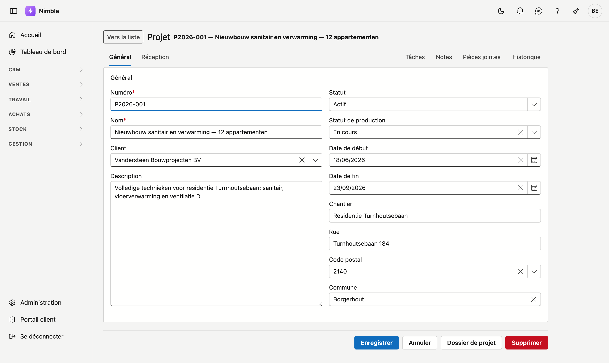
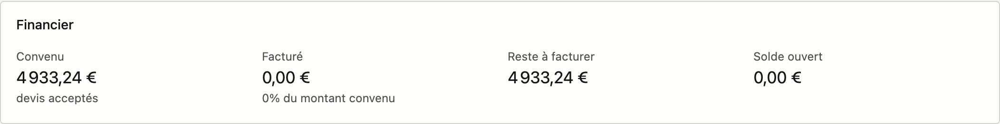
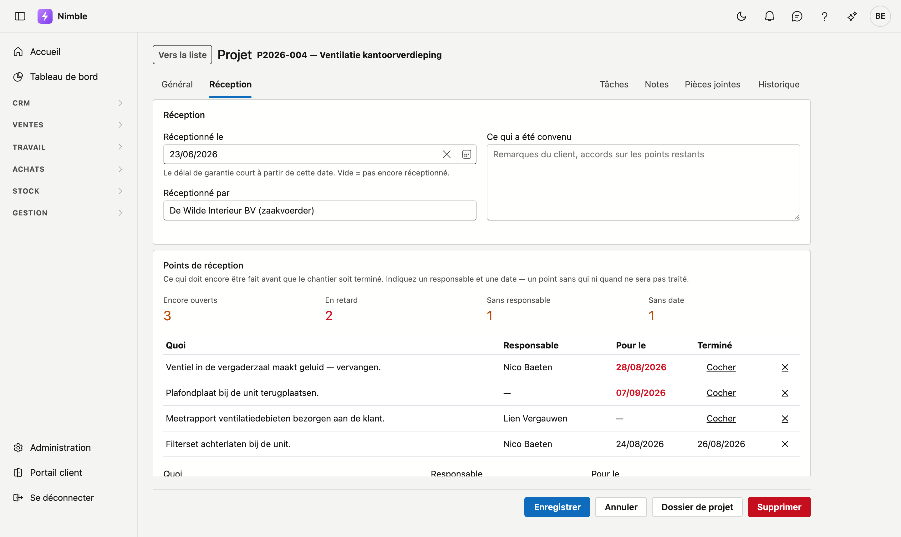

# Projets

Un projet est le chantier auquel tout se rattache : les devis, les ordres de travail, les fiches de
travail et les factures y renvoient. L'écran **Projets** tient la liste à jour ; sur la fiche de projet,
vous enregistrez les données d'un chantier et vous suivez sa réception.

## Ouvrir l'écran

Dans la barre latérale, cliquez sur **Travail → Projets**.

## La liste

La liste affiche six colonnes. **Numéro** et **Nom** sont les plus parlants ; **Client** est la relation
pour laquelle vous travaillez.

- **Nouveau projet** ouvre une fiche vide.
- **Rechercher** filtre sur tout ce qui figure dans la liste.
- Les trois boutons à côté de Rechercher sont l'entonnoir, le sélecteur de colonnes et **Exporter**.
- En bas, vous choisissez le nombre de lignes par page.

À droite se trouve le tiroir **Journal**. Il montre ce qui s'est passé sur les projets ; la flèche l'ouvre.

!!! tip "Un projet sans date de fin"
    La colonne **Fin** peut rester vide. Cela se produit pour un projet **En attente** : une date de début
    est convenue, mais pas encore de fin. Dès que le planning est fixé, vous complétez la date.

## La fiche de projet

Vous ouvrez une fiche en cliquant sur une ligne. Elle comporte deux onglets — **Général** et
**Réception** — et quatre tiroirs à droite : Tâches, Notes, Pièces jointes et Historique.

En bas se trouvent **Enregistrer**, **Annuler**, **Dossier de projet** et **Supprimer**. Ces boutons
restent en place pendant que vous faites défiler la fiche.

### Onglet Général

| Champ | Remarque |
|---|---|
| **Numéro** | Obligatoire. Le numéro de projet auquel les devis et les factures renvoient |
| **Nom** | Obligatoire. L'objet du projet, en une phrase |
| **Client** | La relation pour laquelle vous travaillez. Choisissez dans la liste ; la croix vide le champ |
| **Description** | De la place pour ce qui a été convenu précisément |
| **Statut** | Où en est le projet : **Actif**, **En attente** ou **Terminé** |
| **Statut de production** | Où en est le travail sur le chantier, par exemple **En cours**. C'est indépendant du statut |
| **Date de début** / **Date de fin** | La période d'exécution |
| **Chantier** | Nom ou désignation du chantier, lorsqu'il porte un autre nom que le projet |
| **Rue**, **Code postal**, **Commune** | L'adresse du chantier. Tapez dans **Code postal** et choisissez dans la liste ; **Commune** se complète |

L'adresse du chantier est facultative. Si le chantier se trouve à l'adresse du client, vous pouvez
laisser ces champs vides.

#### Le bloc Financier

Sous les données figurent quatre montants que Nimble calcule lui-même. Vous ne pouvez pas les modifier.
Faites défiler l'onglet Général vers le bas pour les voir.

| Montant | Ce qu'il représente |
|---|---|
| **Convenu** | Le total des devis acceptés pour ce projet |
| **Facturé** | Ce qui a déjà été facturé |
| **Reste à facturer** | La différence entre les deux |
| **Solde ouvert** | Ce que le client doit encore payer |

Sur P2026-001, **Convenu** affiche 4 933,24 € et **Facturé** 0,00 € : le travail est convenu mais rien
n'a encore été facturé. **Reste à facturer** affiche alors le même montant que Convenu.

### Onglet Réception

Sur cet onglet, vous enregistrez la date de réception du chantier et ce qui doit encore être fait.

**Réceptionné le** est la date à laquelle vous avez remis le chantier. Le délai de garantie court à
partir de cette date. Si le champ reste vide, le chantier est considéré comme non réceptionné.

**Réceptionné par** indique qui a fait la réception, ou au nom de qui. Dans **Ce qui a été convenu**,
vous notez les remarques du client et les accords sur les points restants.

#### Points de réception

Un point de réception est une tâche à effectuer avant que le chantier soit entièrement terminé. Au-dessus
de la liste figurent quatre compteurs :

| Compteur | Ce qu'il compte |
|---|---|
| **Encore ouverts** | Les points qui ne sont pas encore cochés |
| **En retard** | Les points dont la date sous **Pour le** est dépassée |
| **Sans responsable** | Les points qui ne sont assignés à personne |
| **Sans date** | Les points sans date sous **Pour le** |

!!! warning "Un point sans responsable ni date reste en plan"
    Les deux derniers compteurs ont leur raison d'être. Un point dont personne ne sait qui s'en charge ni
    pour quand, n'est en pratique jamais traité. Indiquez donc toujours un nom et une date.

Sous la liste, vous ajoutez un point : remplissez **Quoi**, choisissez un **Responsable**, mettez une date
sous **Pour le** et cliquez sur **Ajouter un point**. Dans la liste, vous marquez un point comme fait avec
**Cocher** ; la croix le supprime.

Une date dépassée s'affiche en rouge. Sur l'image ci-dessus, c'est le cas pour deux points.

#### Autorisation de facturation

Au bas de l'onglet, vous voyez si le projet est entièrement clôturé. Si ce n'est pas le cas, vous lisez
pourquoi — par exemple parce que des points de réception sont encore ouverts.

Ce bloc ne vous empêche **pas** de facturer : un état d'avancement précède justement la réception. C'est
un avertissement, pas un verrou.

## Le dossier de projet

Le bouton **Dossier de projet** crée un aperçu du projet en PDF : les données, la situation financière et
tout ce qui est rattaché au projet.

## Voir aussi

- [Travailler avec une fiche](../fiches.md) — le fonctionnement des onglets, des tiroirs et des boutons
- [Filtrer les listes](../lijsten-filteren.md) — rechercher, filtrer et choisir les colonnes
- [Relations](../relations.md) — les clients pour lesquels vous créez des projets
