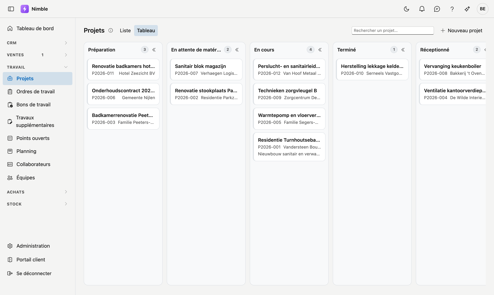
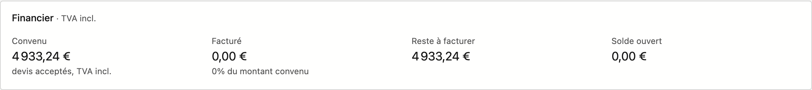
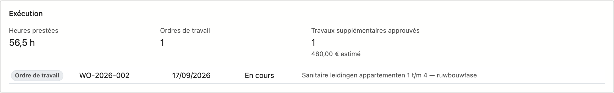
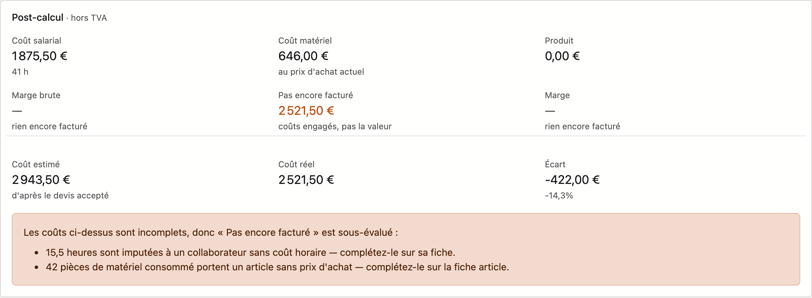
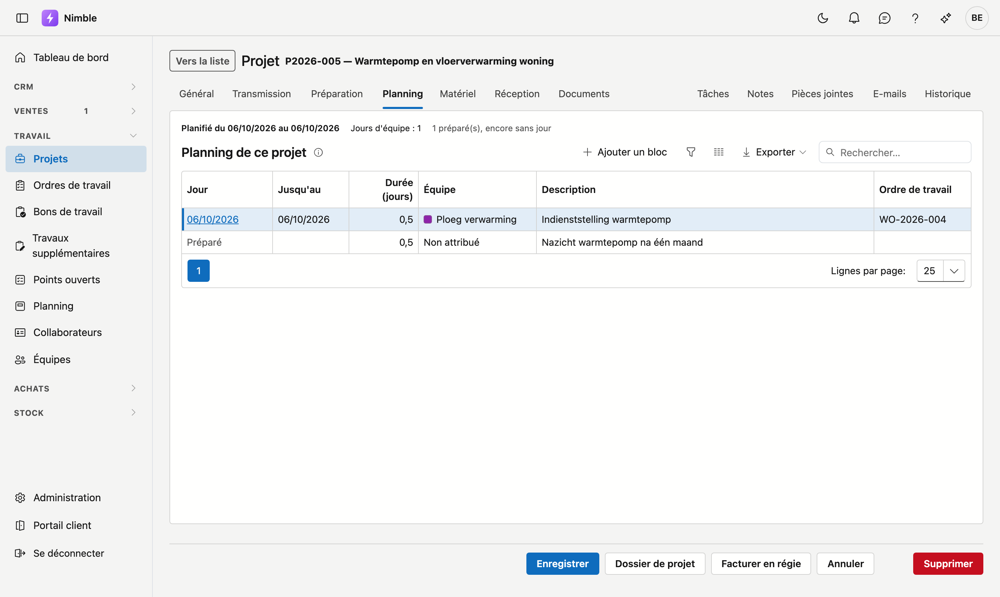
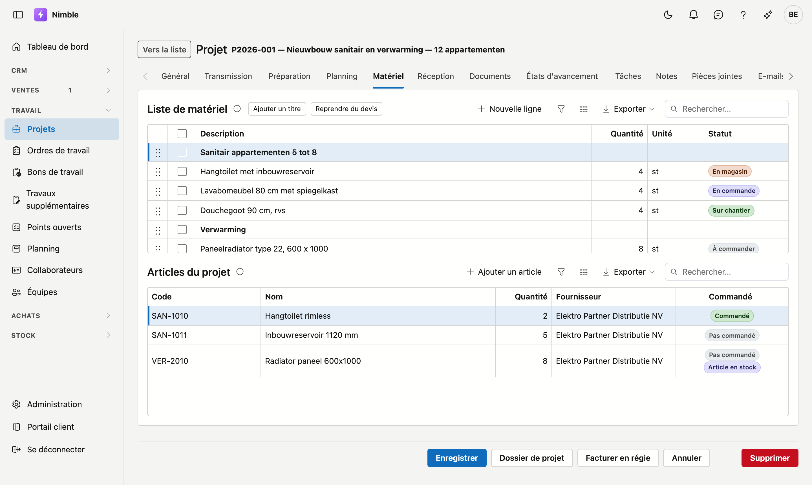
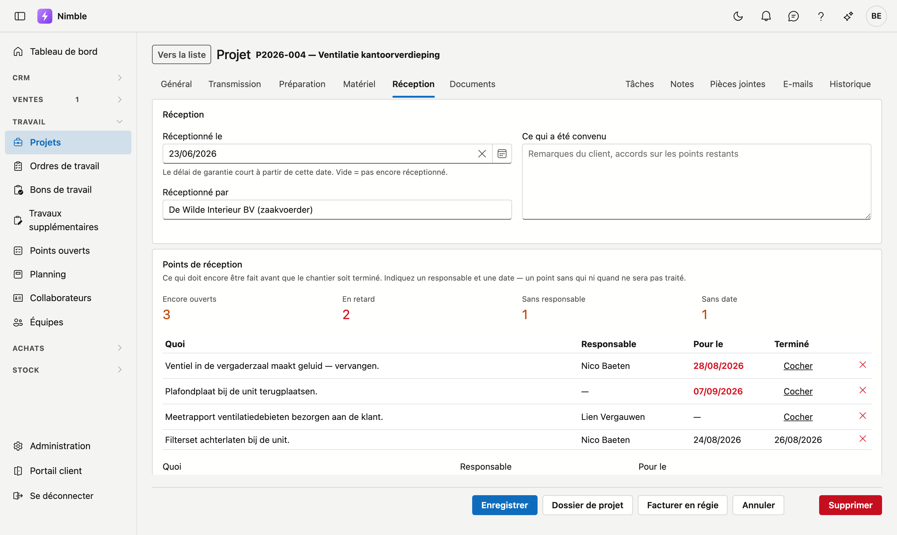
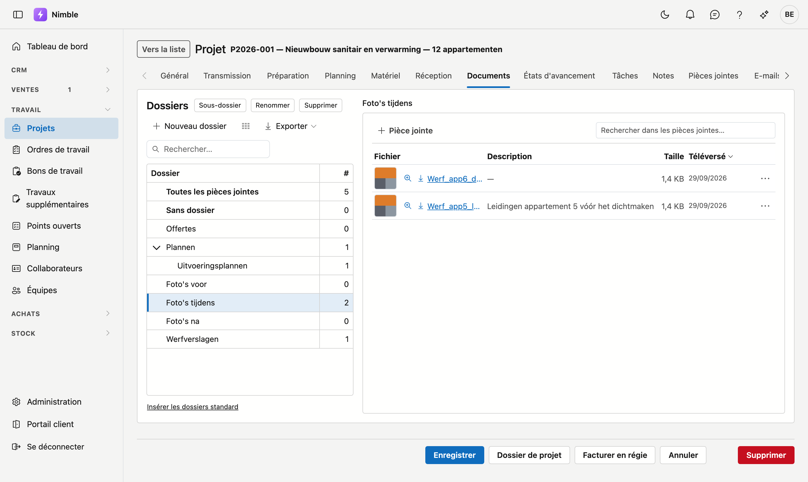

# Projets

Un projet est le chantier auquel tout se rattache : les devis, les ordres de travail, les bons de travail
et les factures y renvoient. L'écran **Projets** tient la liste à jour. Sur la fiche de projet, vous
enregistrez les données d'un chantier, vous voyez comment il se déroule sur le plan financier et dans
l'exécution, et vous suivez sa réception.

## Ouvrir l'écran

Dans la barre latérale, cliquez sur **Travail → Projets**.

## La liste

| Colonne | Ce que c'est |
|---|---|
| **Numéro** | Le numéro de projet |
| **Nom** | L'objet du projet |
| **Client** | La relation pour laquelle vous travaillez |
| **Statut** | **Actif**, **En attente** ou **Terminé** |
| **Responsable** | Qui suit le projet. Filtrez sur votre nom pour voir vos projets |
| **Date de début** / **Fin** | La période d'exécution |
| **Type de projet** | Le type de travail, par exemple une construction neuve |
| **Statut de production** | Où en est le travail sur le chantier. Le carré de couleur devant est la couleur que votre entreprise a donnée à ce statut |
| **Statut pipeline** | Où en est l'affaire sur le plan commercial |
| **Budget (HTVA)** | Le budget du projet, hors TVA. Vide lorsqu'aucun budget n'a été saisi |
| **Commandé** | La case **Commandé** de la fiche. Filtrez dessus pour voir quels projets ne sont pas encore commandés |
| **Créé le** | Le jour où le projet a été créé. Triez dessus pour placer les projets les plus récents en haut |

**Type de projet**, **Statut de production** et **Statut pipeline** n'apparaissent que si votre entreprise a des
valeurs dans cette liste de choix.
Ces listes se gèrent sous **Administration**.

- **Nouveau projet** ouvre une fiche vide.
- Avec **Liste** et **Tableau** à côté du titre, vous passez de cette liste au [tableau](#le-tableau).
- **Rechercher** filtre sur tout ce qui figure dans la liste.
- Les trois boutons à côté de Rechercher sont le filtre, le sélecteur de colonnes et **Exporter**.
- En bas, vous choisissez le nombre de lignes par page.

À droite se trouve le tiroir **Journal**. Il correspond au projet sur lequel se trouve votre curseur :
cliquez sur une ligne et dépliez le tiroir avec la flèche. Vous y trouvez les tâches, notes, pièces jointes
et l'historique de ce projet, sans ouvrir la fiche.

!!! tip "Un projet sans date de fin"
    La colonne **Fin** peut rester vide. Cela se produit pour un projet **En attente** : une date de début
    est convenue, mais pas encore de fin. Dès que le planning est fixé, vous complétez la date.

## Le tableau

Avec **Tableau** à côté du titre, vous voyez les mêmes projets sous forme de cartes, avec une colonne par statut.
Votre choix entre **Liste** et **Tableau** est conservé.

- Les colonnes sont les **statuts de production** de votre entreprise, dans leur ordre. Si votre entreprise
  n'utilise pas de statut de production, le tableau affiche le **statut de pipeline**. Les projets sans statut
  figurent dans la dernière colonne, **Sans statut**.
- Une carte affiche en haut le nom du chantier (ou, s'il est vide, le nom du projet), puis le numéro du projet et
  le client. Cliquez une carte pour ouvrir le projet.
- **Glissez** une carte vers une autre colonne pour changer le statut du projet.
- Avec la double flèche à droite de l'en-tête, vous **repliez** une colonne : elle devient une bande étroite avec son nom
  et le nombre de cartes. Cliquez à nouveau sur la flèche pour la déplier. Nimble retient par utilisateur les colonnes
  repliées.
- Avec **Rechercher un projet…**, vous retrouvez un projet par numéro, nom, nom du chantier, client ou commune.
  Une colonne affiche au maximum 50 cartes ; pour le reste, utilisez la recherche ou la liste.

## La fiche de projet

Vous ouvrez une fiche en double-cliquant sur une ligne.

En haut figurent à gauche les onglets **Général**, **Transmission**, **Préparation**, **Planning**, **Matériel**,
**Réception** et **Documents** — et **États d'avancement** pour un projet avec un devis accepté — et à droite
**Tâches**, **Notes**, **Pièces jointes**, **E-mails** et **Historique**.

En bas se trouve la barre de boutons : **Enregistrer**, **Dossier de projet**, **Annuler** et, à part à
droite, **Supprimer**. La barre reste en place pendant que vous faites défiler la fiche.

- **Dossier de projet** n'apparaît que si vous pouvez consulter les chiffres financiers.
- Si vous ne pouvez pas modifier le projet, **Enregistrer** et **Supprimer** n'apparaissent pas, et
  **Annuler** devient **Vers la liste**.
- **Supprimer** demande d'abord une confirmation. Le projet va dans la corbeille.

### Onglet Général

| Champ | Remarque |
|---|---|
| **Numéro** | Obligatoire. Le numéro de projet auquel les devis et les factures renvoient. Si votre entreprise a une [numérotation des projets](../settings/company-profile.md#numerotation-des-projets), un nouveau projet porte déjà une proposition que vous pouvez modifier |
| **Nom** | Obligatoire. L'objet du projet, en une phrase |
| **Client** | La relation pour laquelle vous travaillez. Choisissez dans la liste ; la croix vide le champ. Le bouton **Vers la fiche client** en dessous ouvre la fiche de ce client |
| **Responsable** | Qui suit le projet. Choisissez parmi les utilisateurs de votre entreprise. C'est aussi la personne qui reprend le dossier lors de la transmission |
| **Description** | De la place pour ce qui a été convenu précisément |
| **Statut** | Où en est le projet : **Actif**, **En attente** ou **Terminé** |
| **Statut de production** | Où en est le travail sur le chantier, par exemple **En cours**. C'est indépendant du statut |
| **Type de projet** | Le type de travail |
| **Statut pipeline** | Où en est l'affaire sur le plan commercial — pas où en est le travail |
| **Date de début** / **Date de fin** | La période d'exécution |
| **Budget (HTVA)** | Le budget du projet, hors TVA. Laissez-le vide lorsqu'il n'y a pas de budget |
| **Commandé** | Cochez lorsque le projet est commandé |
| **Chantier** | Nom ou désignation du chantier, lorsqu'il porte un autre nom que le projet |
| **Rue**, **Code postal**, **Commune** | L'adresse du chantier. Tapez dans **Code postal** et choisissez dans la liste ; **Commune** se complète |
| **Pays** | Le pays du chantier. Tapez une partie du nom et choisissez dans la liste |
| **Contact chantier** | L'interlocuteur sur le chantier. Choisissez parmi les personnes de contact de toutes vos relations, donc aussi d'un architecte ou d'un entrepreneur. Derrière le nom figure la relation à laquelle la personne appartient |

**Statut de production**, **Type de projet** et **Statut pipeline** n'apparaissent que si votre entreprise
a des valeurs dans cette liste de choix.

L'adresse du chantier est facultative. Si vous choisissez un **client** alors que l'adresse du chantier est encore
vide, la fiche reprend l'adresse du client, pays compris. Une adresse de chantier déjà remplie reste inchangée.

Si vous cliquez sur **Enregistrer** alors que **Numéro** ou **Nom** est vide, la fiche indique en haut ce
qui manque.

Sous les données figurent jusqu'à quatre blocs que Nimble remplit lui-même. Vous ne pouvez pas les modifier.
Ils apparaissent sur un projet enregistré, et les trois derniers uniquement s'il y a quelque chose à montrer.

#### Le bloc Financier

Tous les montants de ce bloc sont **TVA incluse**, afin que vous puissiez les comparer à vos factures
et à vos paiements.

| Montant | Ce qu'il représente |
|---|---|
| **Convenu** | Le total des devis acceptés pour ce projet |
| **Facturé** | Ce qui a déjà été facturé, avec en dessous le pourcentage du montant convenu |
| **Reste à facturer** | La différence entre les deux |
| **Solde ouvert** | Ce que le client doit encore payer |

Si l'on a facturé plus que le montant convenu, **Reste à facturer** s'affiche en orange, avec *facturé
au-delà du montant convenu* en dessous. C'est courant avec des travaux supplémentaires, mais vous le voyez
ainsi tout de suite. Si l'on a reçu plus que facturé, **Solde ouvert** indique *reçu plus que facturé*.

#### Le bloc Exécution

Ce bloc apparaît dès qu'un ordre de travail ou des heures prestées figurent sur le projet.

| Tuile | Ce qu'elle montre |
|---|---|
| **Heures prestées** | La somme des heures sur tous les bons de travail de ce projet |
| **Ordres de travail** | Le nombre d'ordres de travail |
| **Bons avec travaux supplémentaires** | Combien de travaux supplémentaires doivent encore être décidés. N'apparaît que s'il y en a |
| **Travaux supplémentaires approuvés** | Combien de travaux supplémentaires sont approuvés, avec le montant estimé. N'apparaît que s'il y en a |

Si un travail supplémentaire approuvé ne porte pas de montant, la tuile indique que le montant est
incomplet.

En dessous figure chaque ordre de travail avec son numéro, sa date planifiée, son statut et sa description.

#### Le bloc Post-calcul

Le post-calcul confronte les coûts réels du chantier à ce que vous avez facturé. Le bloc apparaît dès que
des coûts ou des factures figurent sur le projet. Tous les montants y sont **hors TVA** : la TVA n'est
pas un produit.

| Tuile | Ce qu'elle montre |
|---|---|
| **Coût salarial** | Les heures des bons de travail multipliées par le **Coût horaire** de chaque collaborateur, avec en dessous le nombre d'heures. S'il y a du déplacement, la part figure aussi en dessous : *dont 6 h de déplacement* |
| **Coût matériel** | Le matériel consommé, au prix d'achat actuel de l'article |
| **Produit** | Ce qui a été facturé, hors TVA |
| **Marge brute** | Le produit moins le coût salarial et le coût matériel |
| **Pas encore facturé** | Les coûts engagés qui ne sont pas encore couverts par une facture. C'est ce que le travail a coûté, pas ce qu'il vaut |
| **Marge** | La marge brute en pourcentage du produit |

Quelques cas à connaître :

- Si rien n'est encore facturé, **Marge brute** et **Marge** affichent un tiret avec *rien encore facturé*.
  Un projet en cours ne se lit alors pas comme déficitaire.
- S'il y a du chiffre d'affaires mais aucun coût, elles affichent un tiret avec *aucun coût comptabilisé*.
- Si l'on a facturé plus que les coûts comptabilisés, la cinquième tuile s'appelle **Facturé d'avance**.
- La **Marge** se colore en vert, orange ou rouge selon les seuils de marge de la
  [fiche d'entreprise](../settings/company-profile.md). Sans seuils, elle indique *aucun seuil de marge
  défini* et ne devient rouge qu'en cas de perte.

S'il y a un devis accepté sur le projet, trois montants suivent :

| Montant | Ce que c'est |
|---|---|
| **Coût estimé** | Le prix d'achat des lignes du devis accepté |
| **Coût réel** | Coût salarial plus coût matériel |
| **Écart** | La différence, en euros et en pourcentage. En rouge si le chantier revient plus cher que prévu |

!!! warning "Un cadre orange signifie : les chiffres sont incomplets"
    Nimble ne compte pas un prix manquant comme zéro sans le dire. S'il manque quelque chose, un cadre
    orange apparaît sous le bloc. Il indique quel chiffre est faussé, et pourquoi :

    - des heures sur un collaborateur sans coût horaire ;
    - du matériel consommé sur un article sans prix d'achat ;
    - des heures sur un bon de travail sans collaborateur ;
    - aucun coût comptabilisé.

    Les lignes du devis accepté sans prix d'achat sont aussi signalées : le coût estimé est alors
    sous-évalué. Complétez les données manquantes sur la fiche du collaborateur ou de l'article, et le
    post-calcul sera juste.

#### Le bloc Devis et factures

Ici figurent les devis et les factures de ce projet, avec numéro, date, statut et montant. Une note de
crédit porte sa propre étiquette. Cliquez sur un numéro pour ouvrir le document.

### Onglet Transmission

Cet onglet consigne le moment où les ventes ont transmis le dossier à la direction de projet. C'est le
début de l'exécution, tout comme l'onglet Réception ci-dessous en consigne la fin.

**Transmis le** est la date à laquelle la direction de projet a repris le dossier. À partir de cette date,
c'est elle qui en est responsable. Si le champ reste vide, le dossier est considéré comme non transmis.

**Transmis à** est la personne qui reprend le dossier. C'est le **Responsable** du projet : il s'agit du
même champ que dans l'onglet Général. Si vous choisissez quelqu'un ici, cette personne y figure aussi.

Si un nom a été tapé ici auparavant, vous le voyez sous le champ comme **Saisi
auparavant**. Ce texte n'est pas perdu, mais vous ne pouvez plus le modifier. Choisissez la personne dans la
liste pour compléter le champ.

Dans **Accords ou motif**, vous notez ce qui a été convenu lors de la transmission. Si le dossier est
retourné aux ventes parce qu'il manquait quelque chose, indiquez-en ici la raison. Ainsi, ce qui n'allait
pas figure auprès du dossier lui-même.

!!! warning
    **Un second retour écrase le premier.** Le champ ne porte qu'un seul texte, pas d'historique. Si vous
    souhaitez conserver un suivi, ajoutez le motif précédent au lieu de le remplacer.

#### Ce qui doit être prêt

S'il manque le **client** ou l'**adresse de chantier** (rue et commune), un message apparaît en haut. Sans
ces deux éléments, le chef de projet ne peut rien planifier : il n'y a ni donneur d'ordre, ni lieu où se
rendre.

Les champs restent toutefois modifiables. C'est voulu : un dossier que vous avez transmis auparavant peut
ainsi recevoir sa date sans que vous deviez inventer une adresse.

!!! info
    Le code postal et le pays n'entrent pas en compte pour ce message. Dans les dossiers existants, ces
    champs sont souvent vides alors que l'adresse reste utilisable.

### Onglet Préparation

Ici figure ce qui doit être prêt avant le début du chantier. Un nouveau projet reçoit la **liste standard** de
votre entreprise, que vous gérez dans [Préparation du chantier](../administration/site-preparation.md) ; pour un projet existant, ajoutez-la avec **Ajouter la liste standard**.

- Cochez un point dès qu'il est en ordre. Nimble note la date.
- Choisissez pour chaque point un **Responsable** : la personne qui s'en charge.
- Avec **Ajouter un point**, vous ajoutez un point propre, obligatoire ou non. Le ✕ rouge supprime un point
  qui ne concerne pas ce projet.

En haut figure l'avancement, par exemple *3 sur 7 points obligatoires cochés*. Le projet est **prêt à
démarrer** lorsque tous les points obligatoires sont cochés. Un projet sans aucun point n'est pas prêt : rien
n'a encore été préparé.

Les points ouverts de tous les projets figurent ensemble dans [Points ouverts](open-points.md).

### Onglet Planning

Ici figurent les blocs de ce projet, les mêmes que sur le [tableau de planning](planning.md). Chaque ligne indique
le **Jour**, jusqu'à quand le bloc dure (**Jusqu'au**, en jours ouvrables : le week-end et les jours fériés ne
comptent pas), la **Durée**, l'**Équipe**, la **Description** et l'**Ordre de travail**. Cliquez sur une date pour
ouvrir cette semaine dans le planning.

- Avec **Ajouter un bloc**, vous préparez un bloc pour ce projet. Laissez le **Jour** vide si vous ne savez pas
  encore quand : le bloc figure alors dans **À planifier** sur le tableau de planning, avec sa durée, jusqu'à ce
  que vous le placiez sur un jour.
- Double-cliquez sur une ligne pour ajuster ou supprimer le bloc, dans la même fenêtre que sur le tableau de
  planning. Le projet y est fixé.

En haut figurent la période planifiée du projet, le total de jours d'équipe et le nombre de blocs encore
préparés. La **Date de début** et la **Date de fin** de l'onglet Général ne s'y adaptent pas automatiquement :
vous les remplissez vous-même.

Vous ne voyez cet onglet que si vous pouvez consulter le planning ; ajouter ou modifier des blocs demande le droit
de modifier le planning.

### Onglet Matériel

Vous trouvez ici le matériel de ce projet, en deux listes qui occupent chacune la moitié de l'onglet et défilent
chacune séparément.

#### Liste de matériel

Une ligne est ce qui est nécessaire : une description, une quantité et une unité, avec éventuellement une
description détaillée en dessous. Avec **Ajouter un titre**, vous insérez un titre, par exemple *Démolition*.

Chaque ligne a un **statut** : l'endroit où se trouve le matériel à ce moment.

| Statut | Signification |
|---|---|
| **À commander** | Rien n'a encore été commandé |
| **En commande** | Commandé, pas encore reçu |
| **En magasin** | Reçu, prêt au magasin |
| **Sur chantier** | Livré sur le chantier |

- **Nouvelle ligne** ajoute une ligne ; double-cliquez sur une ligne pour la modifier ou la supprimer.
- Cochez des lignes pour modifier leur statut en une fois : choisissez le statut et cliquez sur **Définir le
  statut**.
- Faites glisser une ligne par la poignée à gauche pour modifier l'ordre.
- **Reprendre du devis** place les lignes du devis accepté de ce projet dans la liste — sans les options ni les
  lignes vides. Vous pouvez le refaire sans crainte : ce qui y figure déjà n'est pas ajouté une seconde fois.

#### Articles du projet

En bas figurent les articles de votre catalogue nécessaires pour ce projet. Cliquez sur **Ajouter un article**,
recherchez l'article par code ou description et choisissez-le. Indiquez ensuite la quantité, le
**Fournisseur**, et s'il est **Commandé** et s'il s'agit d'un **Article en stock**.

### Onglet Réception

Sur cet onglet, vous enregistrez la date de réception du chantier et ce qui doit encore être fait.

**Réceptionné le** est la date à laquelle vous avez remis le chantier. Le délai de garantie court à
partir de cette date. Si le champ reste vide, le chantier est considéré comme non réceptionné.

**Réceptionné par** indique qui a fait la réception, ou au nom de qui. Dans **Ce qui a été convenu**,
vous notez les remarques du client et les accords sur les points restants.

#### Points de réception

Un point de réception est une tâche à effectuer avant que le chantier soit entièrement terminé. Au-dessus
de la liste figurent quatre compteurs :

| Compteur | Ce qu'il compte |
|---|---|
| **Encore ouverts** | Les points qui ne sont pas encore cochés |
| **En retard** | Les points dont la date sous **Pour le** est dépassée |
| **Sans responsable** | Les points qui ne sont assignés à personne |
| **Sans date** | Les points sans date sous **Pour le** |

!!! warning "Un point sans responsable ni date reste en plan"
    Les deux derniers compteurs ont leur raison d'être. Un point dont personne ne sait qui s'en charge ni
    pour quand, n'est en pratique jamais traité. Indiquez donc toujours un nom et une date.

Sous la liste, vous ajoutez un point : remplissez **Quoi**, choisissez un **Responsable**, mettez une date
sous **Pour le** et cliquez sur **Ajouter un point**. Comme responsable, vous choisissez parmi les
collaborateurs actifs.

Dans la liste, vous marquez un point comme fait avec **Cocher** ; la colonne **Terminé** affiche alors la
date. La croix supprime un point. Les points cochés figurent en bas, en gris.

Une date dépassée s'affiche en rouge. Sur l'image ci-dessus, c'est le cas pour deux points.

Les points ouverts de tous les projets figurent ensemble dans [Points ouverts](open-points.md).

#### Autorisation de facturation

Au bas de l'onglet, vous voyez si le projet peut être facturé. S'il n'est pas encore entièrement clôturé,
vous lisez pourquoi : le chantier n'est pas encore réceptionné, ou des points de réception sont encore
ouverts.

Ce bloc ne vous empêche **pas** de facturer : un état d'avancement précède justement la réception. C'est
un avertissement, pas un verrou.

Pour autoriser malgré tout la facturation de façon explicite, cochez **Autoriser malgré tout la
facturation** et indiquez le motif sous **Pourquoi**. Ce motif figure dans l'historique du projet. Sans
motif, l'autorisation ne compte pas.

### Onglet Documents

Vous trouvez ici les pièces jointes de ce projet, classées en dossiers.

À gauche figure l'arborescence. **Toutes les pièces jointes** montre tout, **Sans dossier** ce qui n'est encore
dans aucun dossier ; derrière chaque dossier figure le nombre de pièces jointes qu'il contient. Choisissez un
dossier : à droite, vous ne voyez plus que ses pièces jointes. Ce que vous chargez pendant qu'un dossier est
choisi va dans ce dossier.

- **Nouveau dossier** crée un dossier au niveau principal, **Sous-dossier** un dossier sous le dossier choisi.
  **Renommer** en modifie le nom.
- **Supprimer** n'est possible que pour un dossier vide : sans sous-dossiers ni pièces jointes.
- Pour placer une pièce jointe dans un autre dossier, utilisez le menu en fin de ligne.
- Un nouveau projet reçoit les [dossiers standard](../administration/default-folders.fr.md) de votre entreprise.
  Sur un projet existant, **Insérer les dossiers standard** complète ce qui manque.

Les dossiers n'existent que sur la fiche de projet. Dans le journal à droite, sous **Pièces jointes**, les mêmes
pièces jointes figurent dans une seule liste, sans dossiers.

### Onglet États d'avancement

Pour un projet avec un devis accepté, vous facturez ici au fur et à mesure de l'exécution. L'onglet montre les
états de ce projet, du plus récent au plus ancien ; **Nouvel état d'avancement** crée le suivant. Comment
compléter un état, le faire approuver et le facturer : voir [États d'avancement](../sales/progress-reports.md).

### E-mails dans le journal

À droite, sous **E-mails**, figurent les e-mails de ce projet : les devis et factures envoyés, et les réponses.
Cliquez sur un e-mail pour le lire. Pour les e-mails de l'ancien programme, il se peut que seuls l'expéditeur,
la date et l'objet aient été conservés ; la fenêtre le signale alors.

## Facturer en régie

Le travail qui ne figurait pas dans un devis se facture selon les heures prestées. Cliquez sur **Facturer en
régie**. La fenêtre affiche les heures des bons de travail de ce projet qui ne figurent encore sur aucune
facture : **une ligne par bon de travail et par article horaire**, avec la date et l'ordre de travail, par
exemple *24/09/2026 — WO-2026-0001 — Werkuur installateur*, le nombre d'heures, le prix et le total.

- Le prix provient de l'**article horaire** du collaborateur (voir [Collaborateurs](staff.md)), sinon de
  l'article horaire standard des [données de l'entreprise](../settings/company-profile.md).
- Si quelqu'un n'a ni l'un ni l'autre, ou si l'article horaire n'a pas de prix de vente, la fenêtre indique qui
  ou quoi, et Nimble ne crée pas encore de facture. Complétez et réessayez.
- Le **déplacement** (les lignes d'heures marquées *Déplacement* sur le bon de travail) reçoit sa propre ligne
  au prix de l'**article pour le déplacement** des [données de l'entreprise](../settings/company-profile.md),
  jamais au prix de l'article horaire du travail. Si aucun article pour le déplacement n'est défini, le
  déplacement n'apparaît pas sur la facture et la fenêtre indique combien d'heures cela représente. Cela ne
  bloque pas la facture.
- Cochez les lignes à facturer et cliquez sur **Créer un brouillon de facture**. Vous arrivez sur un brouillon
  que vous pouvez encore vérifier ; la TVA suit le taux du devis accepté du projet.

Les heures qui figurent sur une facture ne reviennent plus dans la fenêtre. Si vous supprimez la ligne ou le
brouillon, ces heures redeviennent ouvertes.

## Le dossier de projet

Le bouton **Dossier de projet** ouvre un aperçu avant impression du projet, que vous pouvez enregistrer en
PDF. Le dossier contient les données et l'adresse du chantier, la situation financière, le post-calcul et
les ordres de travail.

## Voir aussi

- [Travailler avec une fiche](../fiches.md) — le fonctionnement des onglets et des boutons
- [Filtrer les listes](../lijsten-filteren.md) — rechercher, filtrer et choisir les colonnes
- [Relations](../relations.md) — les clients pour lesquels vous créez des projets
- [Ordres de travail](work-orders.md) — le travail sur un projet
- [Collaborateurs](staff.md) — le coût horaire utilisé par le post-calcul
