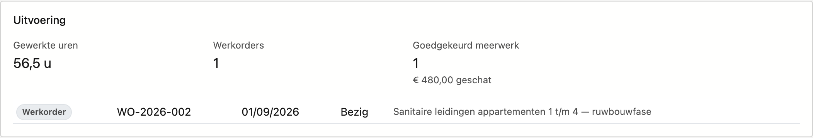
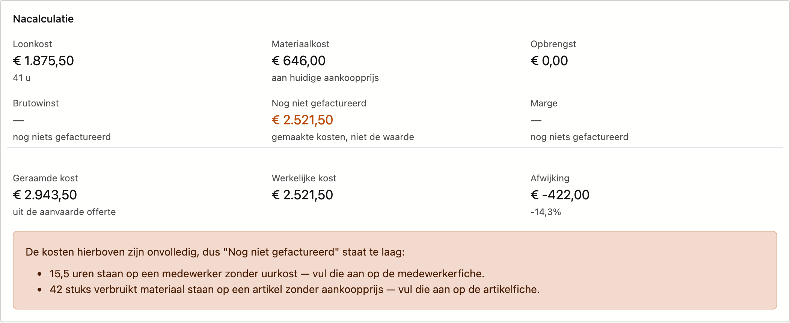

# Projecten

Een project is de werf waar alles aan hangt: offertes, werkorders, werkbonnen en facturen verwijzen
ernaar. Op het scherm **Projecten** houdt u de lijst bij. Op de projectfiche legt u de gegevens van één
werf vast, ziet u hoe de werf financieel en in uitvoering loopt, en volgt u de oplevering op.

## Het scherm openen

Klik in de zijbalk op **Werk → Projecten**.

## De lijst

| Kolom | Wat het is |
|---|---|
| **Nummer** | Het projectnummer |
| **Naam** | Waar het project over gaat |
| **Klant** | De relatie waarvoor u werkt |
| **Status** | **Actief**, **In wacht** of **Afgerond** |
| **Startdatum** / **Einde** | Wanneer het werk loopt |
| **Projecttype** | Wat voor werk het is, bijvoorbeeld Nieuwbouw |
| **Productiestatus** | Waar het werk op de werf staat. Het gekleurde blokje ervoor is de kleur die uw bedrijf aan die status gaf |
| **Pipeline-status** | Waar de zaak commercieel staat |

De laatste drie kolommen verschijnen alleen wanneer uw bedrijf waarden in die keuzelijst heeft. Die lijsten
beheert u onder **Platformbeheer**.

- **Nieuw project** opent een lege fiche.
- Met **Zoeken** filtert u op alles wat in de lijst staat.
- De drie knoppen naast Zoeken zijn de filter, de kolomkiezer en **Exporteren**.
- Onderaan kiest u hoeveel rijen u per pagina wil zien.

Rechts zit de lade **Journaal**. Die hoort bij het project waarop uw cursor staat: klik een rij aan en klap
de lade uit met de pijl. U vindt er de taken, notities, bijlagen en het logboek van dat project, zonder de
fiche te openen.

!!! tip "Een project zonder einddatum"
    De kolom **Einde** mag leeg blijven. Dat komt voor bij een project dat op **In wacht** staat: er is
    een startdatum afgesproken, maar nog geen einde. Zodra de planning vastligt, vult u de datum aan.

## De projectfiche

U opent een fiche door te dubbelklikken op een rij.

Bovenaan staan links de tabbladen **Algemeen** en **Oplevering**, en rechts **Taken**, **Notities**,
**Bijlagen** en **Logboek**.

Onderaan staat de knoppenbalk: **Bewaren**, **Projectdossier**, **Annuleren** en, apart rechts,
**Verwijderen**. De balk blijft staan terwijl u door de fiche scrolt.

- **Projectdossier** ziet u alleen wanneer u de financiële cijfers mag bekijken.
- Mag u het project niet wijzigen, dan ziet u geen **Bewaren** en **Verwijderen**, en heet **Annuleren**
  **Naar de lijst**.
- **Verwijderen** vraagt eerst een bevestiging. Het project gaat naar de prullenbak.

### Tabblad Algemeen

| Veld | Opmerking |
|---|---|
| **Nummer** | Verplicht. Het projectnummer waarmee offertes en facturen naar deze werf verwijzen |
| **Naam** | Verplicht. Waar het project over gaat, in één zin |
| **Klant** | De relatie waarvoor u werkt. Kies uit de lijst; met het kruisje maakt u het veld weer leeg |
| **Omschrijving** | Ruimte voor wat er precies afgesproken is |
| **Status** | Waar het project staat: **Actief**, **In wacht** of **Afgerond** |
| **Productiestatus** | Waar het werk staat op de werf, bijvoorbeeld **In uitvoering**. Dit staat los van de status |
| **Projecttype** | Wat voor werk het is, bijvoorbeeld **Nieuwbouw** |
| **Pipeline-status** | Waar de zaak commercieel staat — niet waar het werk staat |
| **Startdatum** / **Einddatum** | Wanneer het werk loopt |
| **Werf** | Naam of aanduiding van de werf, wanneer die anders heet dan het project |
| **Straat**, **Postcode**, **Gemeente** | Het adres van de werf. Typ in **Postcode** en kies uit de lijst; **Gemeente** vult mee aan |

**Productiestatus**, **Projecttype** en **Pipeline-status** staan er alleen wanneer uw bedrijf waarden in
die keuzelijst heeft.

Het werfadres is optioneel. Ligt de werf op het adres van de klant, dan mag u die velden leeg laten.

Klikt u **Bewaren** terwijl **Nummer** of **Naam** leeg is, dan zegt de fiche bovenaan wat er ontbreekt.

Onder de gegevens staan tot vier blokken die Nimble zelf invult. U kunt ze niet wijzigen. Ze verschijnen
op een bewaard project, en de laatste drie enkel wanneer er iets te tonen is.

#### Het blok Financieel

| Bedrag | Wat het is |
|---|---|
| **Afgesproken** | Het totaal van de aanvaarde offertes voor dit project |
| **Gefactureerd** | Wat er al gefactureerd is, met eronder het percentage van het afgesproken bedrag |
| **Nog te factureren** | Het verschil tussen die twee |
| **Openstaand** | Wat de klant nog moet betalen |

Is er meer gefactureerd dan afgesproken, dan staat **Nog te factureren** in het oranje, met *meer
gefactureerd dan afgesproken* eronder. Bij meerwerk is dat gewoon, maar zo ziet u het meteen. Is er meer
ontvangen dan gefactureerd, dan staat onder **Openstaand** *meer ontvangen dan gefactureerd*.

#### Het blok Uitvoering

Dit blok verschijnt zodra er een werkorder of gewerkte uren op het project staan.

| Tegel | Wat ze toont |
|---|---|
| **Gewerkte uren** | De som van de uren op alle werkbonnen van dit project |
| **Werkorders** | Het aantal werkorders |
| **Werkbonnen met meerwerk** | Hoeveel meerwerken er nog beslist moeten worden. Staat er alleen als die er zijn |
| **Goedgekeurd meerwerk** | Hoeveel meerwerken goedgekeurd zijn, met het geschatte bedrag. Staat er alleen als die er zijn |

Draagt een goedgekeurd meerwerk geen bedrag, dan zegt de tegel dat het bedrag onvolledig is.

Daaronder staat elke werkorder met zijn nummer, geplande datum, status en omschrijving.

#### Het blok Nacalculatie

De nacalculatie zet de werkelijke kosten van de werf tegenover wat u gefactureerd hebt. Het blok verschijnt
zodra er kosten of facturen op het project staan.

| Tegel | Wat ze toont |
|---|---|
| **Loonkost** | De uren op de werkbonnen maal de **Uurkost** van elke medewerker, met eronder het aantal uren |
| **Materiaalkost** | Het verbruikte materiaal, aan de huidige aankoopprijs van het artikel |
| **Opbrengst** | Wat er gefactureerd is, zonder btw |
| **Brutowinst** | Opbrengst min loonkost en materiaalkost |
| **Nog niet gefactureerd** | De gemaakte kosten waar nog geen factuur tegenover staat. Dit is wat het werk gekost heeft, niet wat het waard is |
| **Marge** | De brutowinst als percentage van de opbrengst |

Een paar gevallen om te kennen:

- Is er nog niets gefactureerd, dan tonen **Brutowinst** en **Marge** een streepje met *nog niets
  gefactureerd*. Een lopend project leest dan niet als verlieslatend.
- Staat er omzet maar geen enkele kost, dan tonen ze een streepje met *geen kosten geboekt*.
- Is er meer gefactureerd dan er aan kosten geboekt is, dan heet de vijfde tegel **Vooruit gefactureerd**.
- De **Marge** kleurt groen, oranje of rood volgens de margegrenzen op de
  [Bedrijfsfiche](../settings/company-profile.md). Zonder grenzen staat er *geen margegrenzen ingesteld*, en
  kleurt de marge enkel rood bij verlies.

Staat er een aanvaarde offerte op het project, dan volgen nog drie bedragen:

| Bedrag | Wat het is |
|---|---|
| **Geraamde kost** | De aankoopprijs van de regels op de aanvaarde offerte |
| **Werkelijke kost** | Loonkost plus materiaalkost |
| **Afwijking** | Het verschil, in euro en in procent. Rood wanneer de werf duurder uitvalt dan geraamd |

!!! warning "Een oranje kader betekent: de cijfers zijn onvolledig"
    Nimble telt een ontbrekende prijs niet stilzwijgend als nul. Ontbreekt er iets, dan staat er onder het
    blok een oranje kader. Het zegt welk cijfer daardoor verkeerd staat, en waarom:

    - uren op een medewerker zonder uurkost;
    - verbruikt materiaal op een artikel zonder aankoopprijs;
    - uren op een werkbon zonder medewerker;
    - geen enkele geboekte kost.

    Ook regels op de aanvaarde offerte zonder aankoopprijs worden gemeld: de geraamde kost staat dan te
    laag. Vul de ontbrekende gegevens aan op de medewerker- of artikelfiche, dan klopt de nacalculatie.

#### Het blok Offertes en facturen

Hier staan de offertes en facturen van dit project, met nummer, datum, status en bedrag. Een creditnota
draagt een eigen label. Klik op een nummer om het document te openen.

### Tabblad Oplevering

Op dit tabblad legt u vast wanneer de werf opgeleverd is, en wat er nog moet gebeuren.

**Opgeleverd op** is de datum waarop u de werf hebt overgedragen. Vanaf die datum loopt de
garantietermijn. Blijft het veld leeg, dan geldt de werf als nog niet opgeleverd.

**Opgeleverd door** noteert wie de oplevering deed, of namens wie. In **Wat er afgesproken is** zet u de
opmerkingen van de klant en de afspraken over de resterende punten.

#### Opleverpunten

Een opleverpunt is iets dat nog moet gebeuren vóór de werf helemaal af is. Boven de lijst staan vier
tellers:

| Teller | Wat ze telt |
|---|---|
| **Nog open** | Punten die nog niet afgevinkt zijn |
| **Vervallen** | Punten waarvan de datum bij **Tegen** voorbij is |
| **Zonder eigenaar** | Punten waar niemand aan toegewezen is |
| **Zonder datum** | Punten zonder datum bij **Tegen** |

!!! warning "Een punt zonder eigenaar of datum blijft liggen"
    De laatste twee tellers staan er met reden. Een punt waarvan niemand weet wie het doet of wanneer het
    klaar moet zijn, wordt in de praktijk niet afgewerkt. Zet er dus altijd een naam en een datum bij.

Onder de lijst voegt u een punt toe: vul **Wat** in, kies een **Eigenaar**, zet een datum bij **Tegen** en
klik **Punt toevoegen**. Als eigenaar kiest u uit de actieve medewerkers.

In de lijst zet u een punt klaar met **Afvinken**; in de kolom **Klaar** staat dan de datum. Met het kruisje
verwijdert u een punt. Afgevinkte punten staan onderaan, in het grijs.

Een vervallen datum staat in het rood. In het beeld hierboven is dat het geval bij twee punten.

#### Facturatievrijgave

Onderaan het tabblad staat of het project vrij is om te factureren. Is het nog niet volledig afgehandeld,
dan leest u waarom: de werf is nog niet opgeleverd, of er staan nog opleverpunten open.

Dat blok belet u **niet** om te factureren: een vorderingsstaat hoort net vóór de oplevering. Het is een
waarschuwing, geen grendel.

Wilt u het project toch uitdrukkelijk vrijgeven, vink dan **Toch vrijgeven om te factureren** aan en vul bij
**Waarom** de reden in. Die reden komt in het logboek van het project. Zonder reden telt de vrijgave niet.

## Het projectdossier

Met de knop **Projectdossier** opent u een afdrukvoorbeeld van het project, dat u als PDF kunt bewaren. Het
dossier bevat de gegevens en het werfadres, de financiële stand, de nacalculatie en de werkorders.

## Zie ook

- [Werken met een fiche](../fiches.md) — hoe de tabbladen en knoppen op elke fiche werken
- [Lijsten filteren](../lijsten-filteren.md) — zoeken, filteren en kolommen kiezen
- [Relaties](../relations.md) — de klanten waarvoor u projecten aanmaakt
- [Werkorders](work-orders.md) — het werk op een project
- [Medewerkers](staff.md) — de uurkost waarmee de nacalculatie rekent
