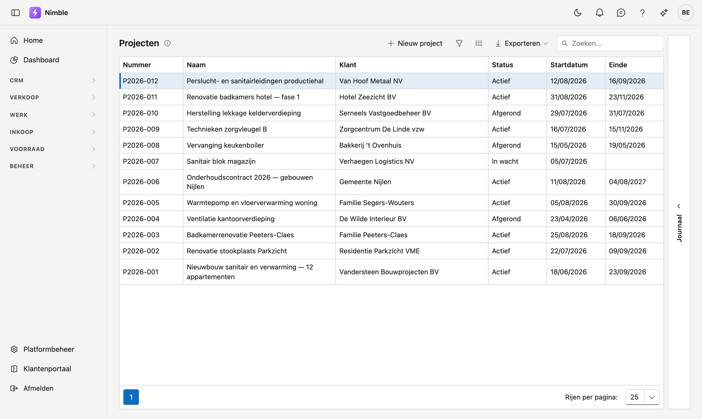
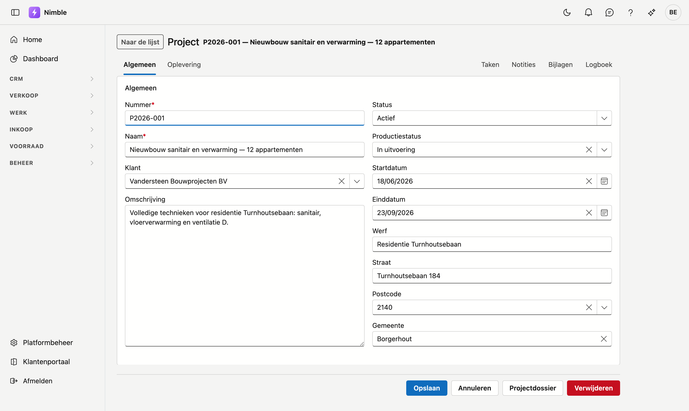
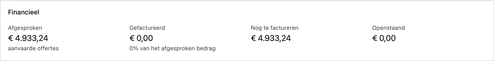
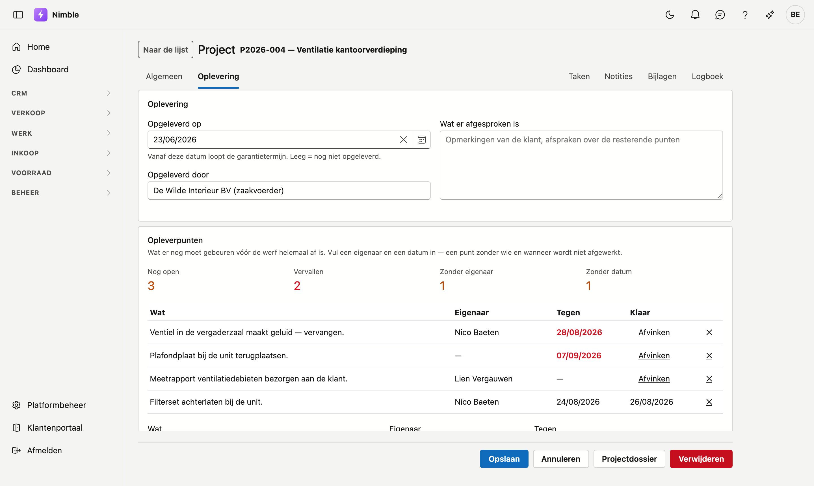

# Projecten

Een project is de werf waar alles aan hangt: offertes, werkorders, werkbonnen en facturen verwijzen
ernaar. Op het scherm **Projecten** houdt u de lijst bij; op de projectfiche legt u de gegevens van één
werf vast en volgt u de oplevering op.

## Het scherm openen

Klik in de zijbalk op **Werk → Projecten**.

## De lijst

De lijst toont zes kolommen. **Nummer** en **Naam** herkent u het snelst; **Klant** is de relatie waarvoor
u werkt.

- **Nieuw project** opent een lege fiche.
- Met **Zoeken** filtert u op alles wat in de lijst staat.
- De drie knoppen naast Zoeken zijn de filter, de kolomkiezer en **Exporteren**.
- Onderaan kiest u hoeveel rijen u per pagina wil zien.

Rechts zit de lade **Journaal**. Die toont wat er op de projecten gebeurd is; u opent hem met de pijl.

!!! tip "Een project zonder einddatum"
    De kolom **Einde** mag leeg blijven. Dat komt voor bij een project dat op **In wacht** staat: er is
    een startdatum afgesproken, maar nog geen einde. Zodra de planning vastligt, vult u de datum aan.

## De projectfiche

U opent een fiche door op een rij te klikken. De fiche heeft twee tabbladen — **Algemeen** en
**Oplevering** — en rechts vier lades: Taken, Notities, Bijlagen en Logboek.

Onderaan staan **Opslaan**, **Annuleren**, **Projectdossier** en **Verwijderen**. Die knoppen blijven
staan terwijl u door de fiche scrolt.

### Tabblad Algemeen

| Veld | Opmerking |
|---|---|
| **Nummer** | Verplicht. Het projectnummer waarmee offertes en facturen naar deze werf verwijzen |
| **Naam** | Verplicht. Waar het project over gaat, in één zin |
| **Klant** | De relatie waarvoor u werkt. Kies uit de lijst; met het kruisje maakt u het veld weer leeg |
| **Omschrijving** | Ruimte voor wat er precies afgesproken is |
| **Status** | Waar het project staat: **Actief**, **In wacht** of **Afgerond** |
| **Productiestatus** | Waar het werk staat op de werf, bijvoorbeeld **In uitvoering**. Dit staat los van de status |
| **Startdatum** / **Einddatum** | Wanneer het werk loopt |
| **Werf** | Naam of aanduiding van de werf, wanneer die anders heet dan het project |
| **Straat**, **Postcode**, **Gemeente** | Het adres van de werf. Typ in **Postcode** en kies uit de lijst; **Gemeente** vult mee aan |

Het werfadres is optioneel. Ligt de werf op het adres van de klant, dan mag u die velden leeg laten.

#### Het blok Financieel

Onder de gegevens staan vier bedragen die Nimble zelf berekent. U kunt ze niet wijzigen. Scroll naar
beneden op het tabblad Algemeen om ze te zien.

| Bedrag | Wat het is |
|---|---|
| **Afgesproken** | Het totaal van de aanvaarde offertes voor dit project |
| **Gefactureerd** | Wat er al gefactureerd is |
| **Nog te factureren** | Het verschil tussen die twee |
| **Openstaand** | Wat de klant nog moet betalen |

Op P2026-001 staat **Afgesproken** op € 4.933,24 en **Gefactureerd** op € 0,00: het werk is afgesproken
maar er is nog niets gefactureerd. **Nog te factureren** toont dan hetzelfde bedrag als Afgesproken.

### Tabblad Oplevering

Op dit tabblad legt u vast wanneer de werf opgeleverd is, en wat er nog moet gebeuren.

**Opgeleverd op** is de datum waarop u de werf hebt overgedragen. Vanaf die datum loopt de
garantietermijn. Blijft het veld leeg, dan geldt de werf als nog niet opgeleverd.

**Opgeleverd door** noteert wie de oplevering deed, of namens wie. In **Wat er afgesproken is** zet u de
opmerkingen van de klant en de afspraken over de resterende punten.

#### Opleverpunten

Een opleverpunt is iets dat nog moet gebeuren vóór de werf helemaal af is. Boven de lijst staan vier
tellers:

| Teller | Wat ze telt |
|---|---|
| **Nog open** | Punten die nog niet afgevinkt zijn |
| **Vervallen** | Punten waarvan de datum bij **Tegen** voorbij is |
| **Zonder eigenaar** | Punten waar niemand aan toegewezen is |
| **Zonder datum** | Punten zonder datum bij **Tegen** |

!!! warning "Een punt zonder eigenaar of datum blijft liggen"
    De laatste twee tellers staan er met reden. Een punt waarvan niemand weet wie het doet of wanneer het
    klaar moet zijn, wordt in de praktijk niet afgewerkt. Zet er dus altijd een naam en een datum bij.

Onder de lijst voegt u een punt toe: vul **Wat** in, kies een **Eigenaar**, zet een datum bij **Tegen** en
klik **Punt toevoegen**. In de lijst zelf zet u een punt klaar met **Afvinken**; met het kruisje verwijdert
u het.

Een vervallen datum staat in het rood. In het beeld hierboven is dat het geval bij twee punten.

#### Facturatievrijgave

Onderaan het tabblad staat of het project volledig afgehandeld is. Is dat niet zo, dan leest u waarom —
bijvoorbeeld omdat de werf nog niet opgeleverd is.

Dat blok belet u **niet** om te factureren: een vorderingsstaat hoort net vóór de oplevering. Het is een
waarschuwing, geen grendel.

## Het projectdossier

Met de knop **Projectdossier** maakt u een overzicht van het project als PDF: de gegevens, de financiële
stand en wat er aan het project hangt.

## Zie ook

- [Werken met een fiche](../fiches.md) — hoe de tabbladen, lades en knoppen op elke fiche werken
- [Lijsten filteren](../lijsten-filteren.md) — zoeken, filteren en kolommen kiezen
- [Relaties](../relations.md) — de klanten waarvoor u projecten aanmaakt
