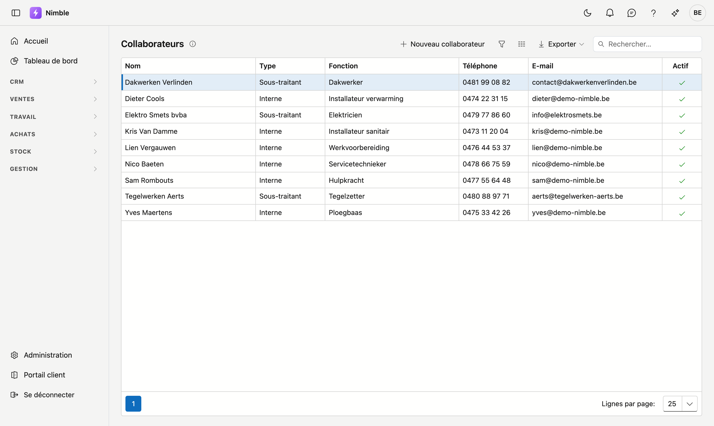
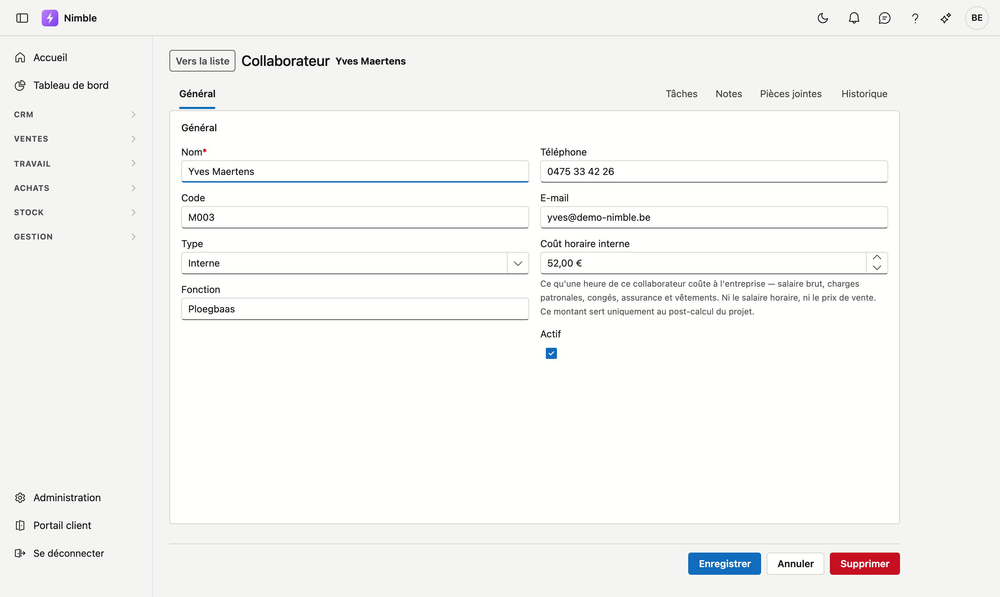

# Collaborateurs

Toutes les personnes qui interviennent sur vos chantiers : vos propres gens et les sous-traitants avec
lesquels vous travaillez. Nimble utilise cette liste pour affecter des heures sur les fiches de travail et
pour calculer le prix de revient d'un projet.

## Ouvrir l'écran

Dans la barre latérale, cliquez sur **Travail → Collaborateurs**.

## La liste

La liste affiche six colonnes. Sous **Type** figure la distinction qui se répercute partout :

| Type | Ce que cela signifie |
|---|---|
| **Interne** | Quelqu'un sur votre liste de paie |
| **Sous-traitant** | Une partie externe à laquelle vous faites appel |

- **Nouveau collaborateur** ouvre une fiche vide.
- Les trois boutons à côté de Rechercher sont l'entonnoir, le sélecteur de colonnes et **Exporter**.

Décochez **Actif** pour qui ne travaille plus avec vous. Le collaborateur continue d'exister — ses heures
sur d'anciennes fiches de travail restent correctes — mais il n'apparaît plus dans les listes de choix.

## La fiche

Vous ouvrez une fiche en cliquant sur une ligne.

| Champ | Remarque |
|---|---|
| **Nom** | Obligatoire |
| **Code** | Votre propre référence, par exemple un numéro de personnel |
| **Type** | **Interne** ou **Sous-traitant** |
| **Fonction** | Ce que fait cette personne : installateur, chef d'équipe, électricien… |
| **Téléphone** | |
| **E-mail** | Vide est permis. Si vous saisissez quelque chose, ce doit être une adresse valide |
| **Coût horaire interne** | Voir ci-dessous — ce champ mérite votre attention |
| **Actif** | Décoché signifie : existe encore, mais n'est plus proposé |

### Le coût horaire interne

C'est *ce qu'une heure de travail de ce collaborateur coûte à votre entreprise* : salaire brut plus
charges patronales, congés, assurance et vêtements. Ce n'est donc pas le salaire horaire que le
collaborateur voit, ni le prix que vous facturez au client.

Nimble utilise ce montant à un seul endroit : le **post-calcul** sur la fiche de projet, où les coûts
réels sont confrontés aux recettes.

!!! warning "Sans coût horaire, un collaborateur compte pour zéro"
    Si vous laissez ce champ vide, les heures de cette personne comptent comme *gratuites*. La marge du
    projet est alors trop élevée, et aucun message d'erreur n'apparaît — seulement une ligne sous le
    chiffre indiquant qu'il y a des heures sans taux horaire. Complétez donc ce champ, même par une
    estimation.

## Voir aussi

- [Équipes](teams.md) — regrouper des collaborateurs en une équipe
- [Projets](projects.md) — là où le post-calcul utilise ce coût horaire
- [Travailler avec une fiche](../fiches.md) — le fonctionnement des onglets, des tiroirs et des boutons
