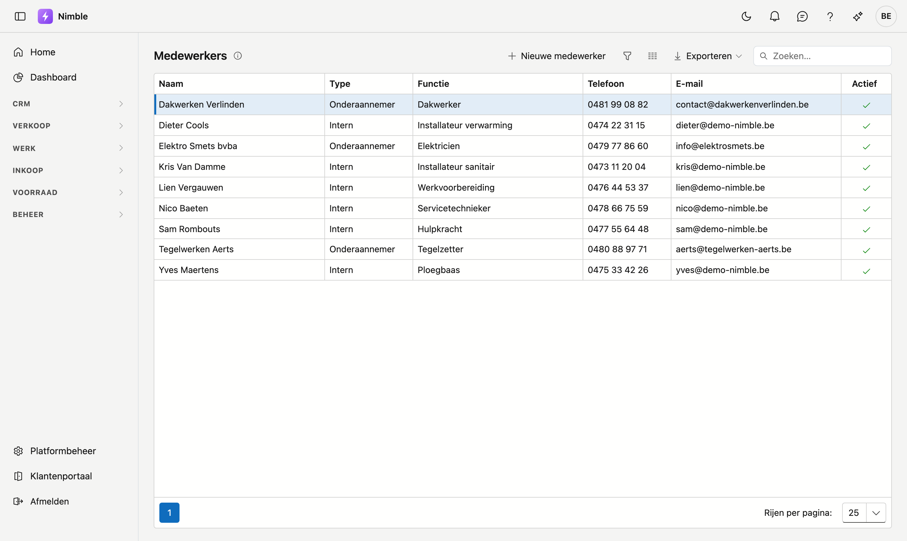
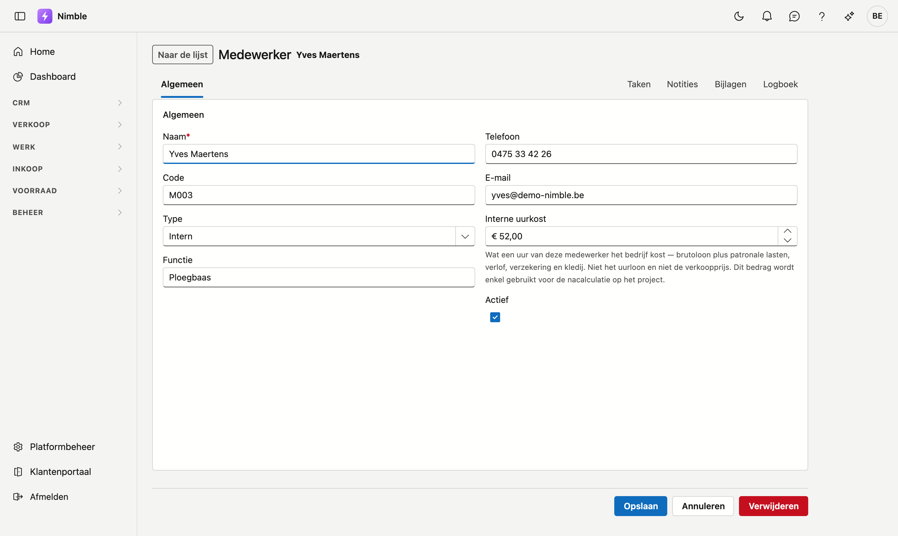

# Medewerkers

Iedereen die op uw werven staat: uw eigen mensen én de onderaannemers waarmee u werkt. Nimble gebruikt
deze lijst om uren toe te wijzen op werkbonnen en om de kostprijs van een project te berekenen.

## Het scherm openen

Klik in de zijbalk op **Werk → Medewerkers**.

## De lijst

De lijst toont zes kolommen. In **Type** ziet u het onderscheid dat overal doorwerkt:

| Type | Wat het betekent |
|---|---|
| **Intern** | Iemand op uw loonlijst |
| **Onderaannemer** | Een externe partij die u inschakelt |

- **Nieuwe medewerker** opent een lege fiche.
- De drie knoppen naast Zoeken zijn de filter, de kolomkiezer en **Exporteren**.

Zet **Actief** uit voor wie niet meer meewerkt. De medewerker blijft dan bestaan — zijn uren op oude
werkbonnen blijven kloppen — maar hij verschijnt niet meer in de keuzelijsten.

## De fiche

U opent een fiche door op een rij te klikken.

| Veld | Opmerking |
|---|---|
| **Naam** | Verplicht |
| **Code** | Uw eigen kenmerk, bijvoorbeeld een personeelsnummer |
| **Type** | **Intern** of **Onderaannemer** |
| **Functie** | Wat deze persoon doet: installateur, ploegbaas, elektricien… |
| **Telefoon** | |
| **E-mail** | Leeg mag. Vult u iets in, dan moet het een geldig adres zijn |
| **Interne uurkost** | Zie hieronder — dit veld verdient aandacht |
| **Actief** | Uit betekent: bestaat nog, maar wordt niet meer voorgesteld |

### De interne uurkost

Dit is *wat één gewerkt uur van deze medewerker uw onderneming kost*: brutoloon plus patronale lasten,
verlof, verzekering en kledij. Het is dus niet het uurloon dat de medewerker ziet, en niet de prijs die u
aan de klant aanrekent.

Nimble gebruikt dit bedrag op één plaats: de **nacalculatie** op de projectfiche, waar de werkelijke kosten
tegenover de opbrengst staan.

!!! warning "Zonder uurkost telt een medewerker voor nul"
    Laat u dit veld leeg, dan tellen de uren van deze persoon mee als *kosteloos*. De marge op het project
    staat dan te hoog, en er verschijnt geen foutmelding — alleen een regel onder het cijfer die zegt dat er
    uren zonder uurtarief zijn. Vul het veld dus in, ook bij een schatting.

## Zie ook

- [Ploegen](teams.md) — medewerkers groeperen tot een ploeg
- [Projecten](projects.md) — waar de nacalculatie met deze uurkost rekent
- [Werken met een fiche](../fiches.md) — hoe de tabbladen, lades en knoppen op elke fiche werken
