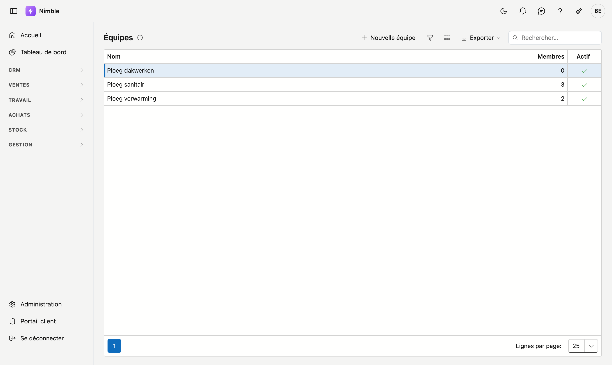
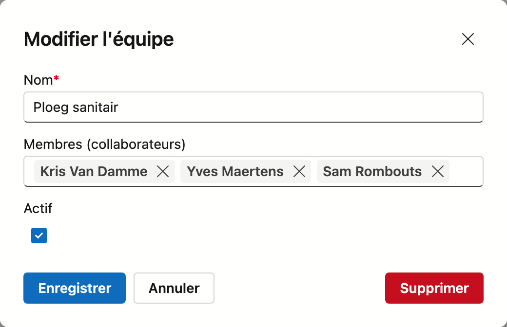

# Équipes

Une équipe est un groupe de collaborateurs qui interviennent ensemble sur un chantier. Vous planifiez une
équipe plutôt que des personnes isolées, ce qui fait gagner du temps dès que la même combinaison revient.

## Ouvrir l'écran

Dans la barre latérale, cliquez sur **Travail → Équipes**.

## La liste

La liste est courte : **Nom**, le nombre de **Membres** et **Actif**.

Une équipe sans membres peut exister — vous pouvez en créer une et la compléter plus tard. Sur l'image
ci-dessus, c'est le cas de Ploeg dakwerken.

## Composer une équipe

Les équipes n'ont pas de fiche distincte. Vous cliquez sur une ligne — ou sur **Nouvelle équipe** — et
travaillez dans une fenêtre.

| Champ | Remarque |
|---|---|
| **Nom** | Obligatoire. Nommez l'équipe d'après ce qu'elle fait, non d'après qui la compose — ainsi le nom reste juste en cas de changement |
| **Membres (collaborateurs)** | Choisissez parmi les collaborateurs. Chaque membre figure comme étiquette dans le champ ; la croix l'en retire |
| **Actif** | Décoché signifie : existe encore, mais n'est plus proposé lors de la planification |

**Enregistrer** fixe la composition, **Supprimer** retire l'équipe.

!!! tip "Une personne peut faire partie de plusieurs équipes"
    La liste des membres n'est pas un choix exclusif. Un chef d'équipe qui dirige deux équipes, vous le
    mettez simplement dans les deux.

!!! warning "Retirer un collaborateur d'une équipe n'efface rien"
    Si vous retirez quelqu'un d'une équipe, seul ce lien disparaît. Le collaborateur continue d'exister, et
    les heures qu'il a déjà sur des fiches de travail restent inchangées.

## Voir aussi

- [Collaborateurs](staff.md) — les personnes dont vous composez une équipe
- [Projets](projects.md) — les chantiers sur lesquels vous planifiez une équipe
