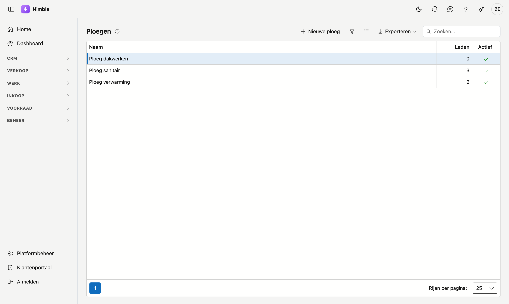
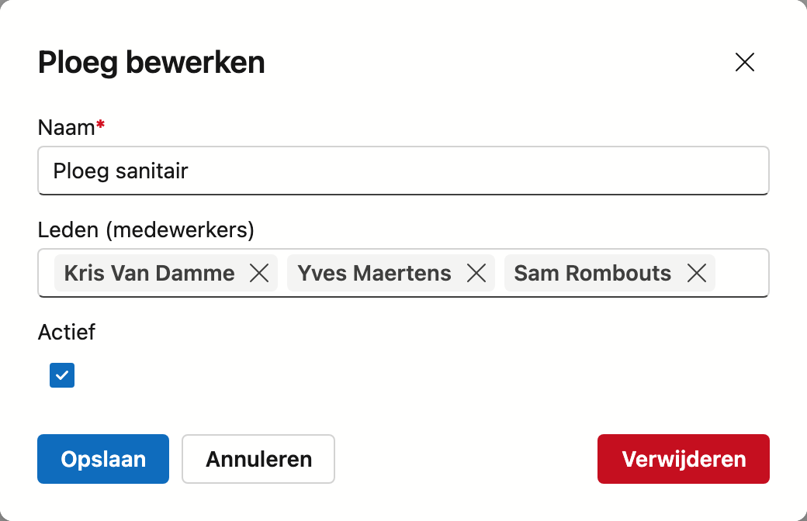

# Ploegen

Een ploeg is een groep medewerkers die samen op een werf staat. U plant een ploeg in plaats van losse
mensen, en dat scheelt werk zodra dezelfde combinatie vaker terugkomt.

## Het scherm openen

Klik in de zijbalk op **Werk → Ploegen**.

## De lijst

De lijst is kort: **Naam**, het aantal **Leden** en **Actief**.

Een ploeg zonder leden mag bestaan — u kunt er een aanmaken en later pas invullen. In het beeld hierboven
is dat het geval bij Ploeg dakwerken.

## Een ploeg samenstellen

Ploegen heeft geen aparte fiche. U klikt op een rij — of op **Nieuwe ploeg** — en werkt in een venster.

| Veld | Opmerking |
|---|---|
| **Naam** | Verplicht. Noem de ploeg naar wat ze doet, niet naar wie erin zit — dan blijft de naam kloppen als er iemand wisselt |
| **Leden (medewerkers)** | Kies uit de medewerkers. Elk lid staat als etiket in het vak; met het kruisje haalt u iemand er weer uit |
| **Actief** | Uit betekent: bestaat nog, maar wordt niet meer voorgesteld bij het plannen |

**Opslaan** legt de samenstelling vast, **Verwijderen** haalt de ploeg weg.

!!! tip "Iemand kan in meer dan één ploeg zitten"
    De ledenlijst is geen exclusieve keuze. Een ploegbaas die twee ploegen aanstuurt, zet u gewoon in
    allebei.

!!! warning "Een medewerker verwijderen uit een ploeg wist niets"
    Haalt u iemand uit een ploeg, dan verdwijnt alleen die koppeling. De medewerker blijft bestaan, en de
    uren die hij al op werkbonnen heeft staan blijven ongewijzigd.

## Zie ook

- [Medewerkers](staff.md) — de mensen waaruit u een ploeg samenstelt
- [Projecten](projects.md) — de werven waarop u een ploeg inplant
