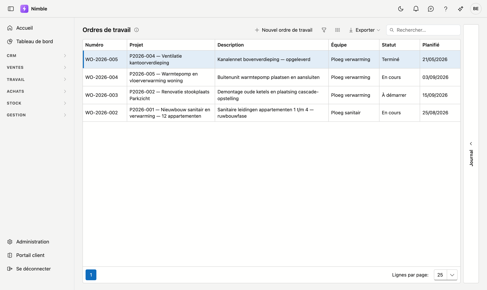
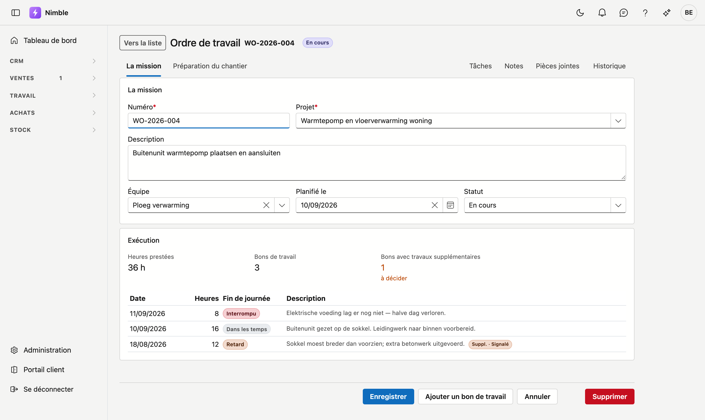
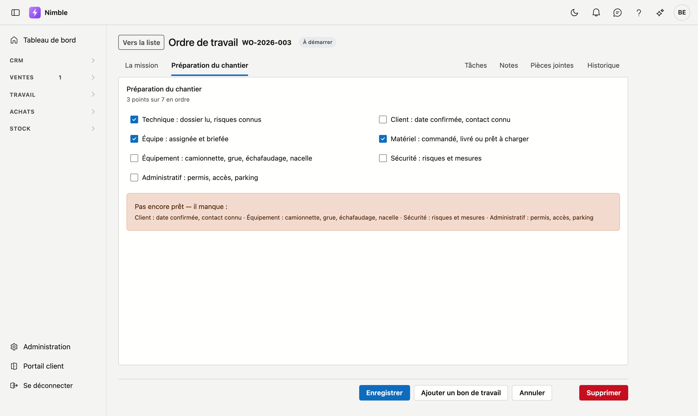

# Ordres de travail

Un ordre de travail est **ce qui doit être fait sur un chantier**, sous un projet. Les bons de travail qui
en dépendent sont les journées durant lesquelles on y a effectivement travaillé. Tout s'articule ainsi :

**Projet → ordre de travail → bon de travail.** Le projet est la mission du client, l'ordre de travail est
une partie du travail sur ce projet, et chaque bon de travail est une journée de chantier.

## Ouvrir l'écran

Cliquez dans la barre latérale sur **Travail → Ordres de travail**.

## La liste

| Colonne | Ce que c'est |
|---|---|
| **Numéro** | La référence de l'ordre de travail, par exemple WO-2026-004 |
| **Projet** | Le projet dont relève l'ordre de travail, avec son numéro et son nom |
| **Description** | Ce qui doit être fait — c'est ce qui distingue deux ordres de travail sur un même projet |
| **Équipe** | L'équipe qui exécute le chantier |
| **Statut** | À démarrer · En cours · Terminé |
| **Planifié** | Le jour prévu pour le travail |

- **Nouvel ordre de travail** ouvre une fiche vierge.
- Les trois boutons à côté de Rechercher sont le filtre, le sélecteur de colonnes et **Exporter**.

À droite se trouve le tiroir **Journal**. Il correspond à l'ordre de travail sur lequel se trouve votre
curseur : cliquez sur une ligne et dépliez le tiroir avec la flèche. Vous y trouvez les tâches, notes,
pièces jointes et l'historique de cet ordre de travail, sans ouvrir la fiche.

## La fiche

Vous ouvrez une fiche en cliquant sur une ligne.

### La mission

| Champ | Remarque |
|---|---|
| **Numéro** | Obligatoire. Votre propre référence pour cet ordre de travail |
| **Projet** | Obligatoire. Le projet dont relève l'ordre de travail |
| **Description** | Ce qui doit être fait. C'est ce qui distingue l'ordre de travail du projet |
| **Équipe** | Qui exécute le chantier |
| **Planifié le** | Le jour prévu |
| **Statut** | À démarrer · En cours · Terminé |

### Exécution

Ce bloc, vous ne le remplissez **pas** — il se base sur les bons de travail rattachés à cet ordre.

- **Heures prestées** est la somme de toutes les heures de tous les bons.
- **Bons de travail** en donne le nombre.
- **Bons avec travaux supplémentaires** compte les journées où l'équipe a constaté du travail en plus, avec
  en dessous combien restent à trancher.

En dessous figure chaque bon avec sa date, ses heures, sa fin de journée et sa description. Vous voyez
ainsi d'un coup d'œil comment le chantier s'est déroulé.

**Ajouter un bon de travail** crée un nouveau bon déjà rattaché à cet ordre de travail.

## Préparation du chantier

Le deuxième onglet reprend sept points qui doivent être en ordre avant le démarrage.

| Point | De quoi il s'agit |
|---|---|
| **Technique** | Dossier lu, risques connus |
| **Client** | Date de démarrage confirmée, personne de contact connue |
| **Équipe** | Affectée et briefée |
| **Matériaux** | Commandés, livrés ou prêts à charger |
| **Matériel** | Camionnette, grue, échafaudage, nacelle |
| **Sécurité** | Risques et mesures |
| **Administratif** | Permis, accès, parking |

Lorsque les sept sont cochés, l'ordre de travail porte en haut la mention **Prêt à démarrer** et l'écran
indique que le chantier peut commencer. S'il en manque, le cadre nomme **lequel** — pas seulement qu'il en
manque un.

!!! note "Uniquement tant que le chantier doit encore démarrer"
    La mention **Prêt à démarrer** et le message qui l'accompagne n'apparaissent que lorsque le statut est
    **À démarrer** — c'est à ce moment-là que la question se pose. Dès que le chantier est **En cours** ou
    **Terminé**, les sept cases restent affichées à titre de référence de ce qui était en ordre avant le
    démarrage, et l'écran l'indique.

!!! tip "Sept points, et aucune case unique « préparé »"
    Une seule case vous dirait *que* ce n'est pas en ordre, mais pas *ce* qui manque. C'est pourquoi les
    sept figurent séparément : vous pouvez confier le chantier à quelqu'un d'autre et cette personne voit
    immédiatement par où commencer.

## Supprimer un ordre de travail

Ce n'est possible **que si aucun bon de travail n'y est rattaché**. S'il y en a, Nimble refuse et indique
combien :

> **Attention** — Cet ordre de travail ne peut pas être supprimé : 3 bon(s) de travail y sont encore
> rattachés, avec des heures prestées. Supprimez d'abord ces bons.

La raison est qu'un bon de travail porte des heures prestées. Si l'ordre de travail disparaît, ces heures
subsistent sans que personne ne voie encore à quelle mission elles se rapportent — et c'est là-dessus que
reposent le calcul a posteriori et la facturation des travaux supplémentaires.

!!! note "La corbeille compte également"
    Un bon que vous avez supprimé se trouve dans la corbeille et peut en ressortir. Nimble le compte donc :
    sinon, vous pourriez supprimer l'ordre de travail puis restaurer le bon, avec une mission qui n'existe
    plus.

Vous souhaitez retirer un chantier terminé de votre liste quotidienne ? Mettez le statut sur **Terminé**
plutôt que de supprimer l'ordre de travail.
