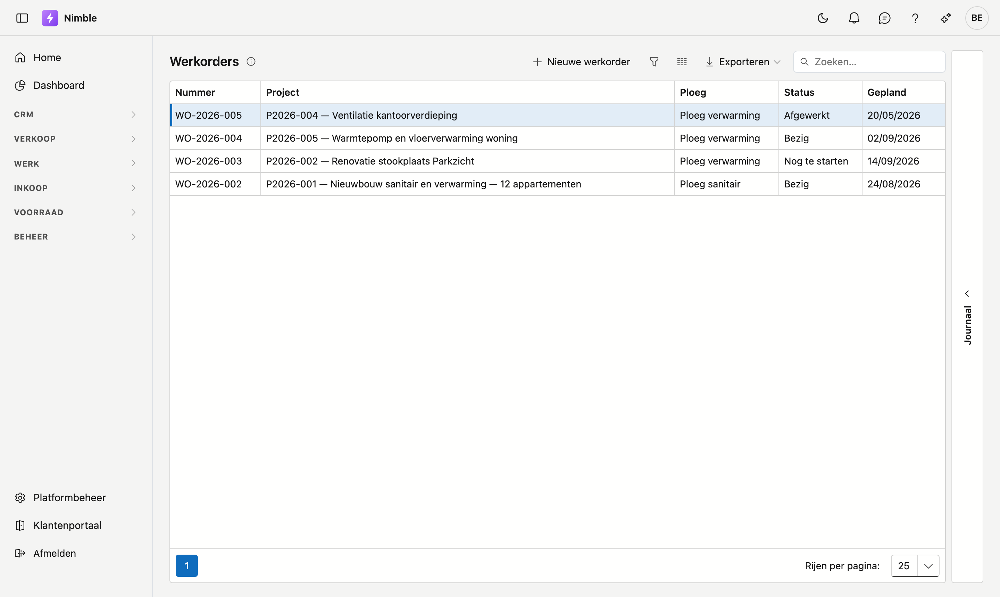
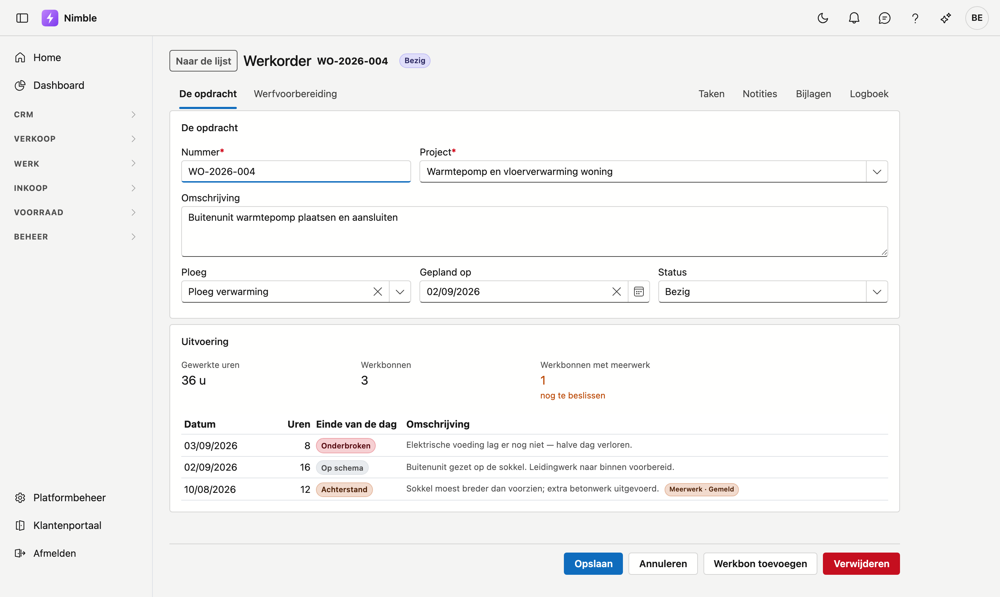
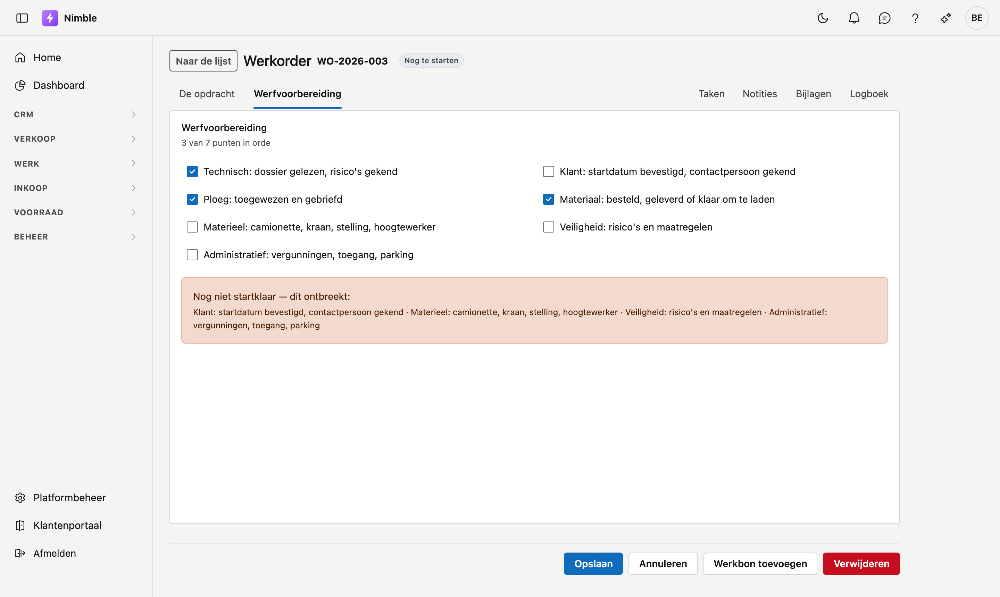

# Werkorders

Een werkorder is **wat er op een werf moet gebeuren**, onder een project. De werkbonnen eronder zijn de
dagen waarop er effectief aan gewerkt is. Zo hangt alles samen:

**Project → werkorder → werkbon.** Het project is de opdracht van de klant, de werkorder is een stuk werk
op dat project, en elke werkbon is één werkdag.

## Het scherm openen

Klik in de zijbalk op **Werk → Werkorders**.

## De lijst

| Kolom | Wat het is |
|---|---|
| **Nummer** | Het kenmerk van de werkorder, bijvoorbeeld WO-2026-004 |
| **Project** | Het project waar de werkorder onder valt, met nummer en naam |
| **Ploeg** | De ploeg die de werf doet |
| **Status** | Nog te starten · Bezig · Afgewerkt |
| **Gepland** | De dag waarop het werk voorzien is |

- **Nieuwe werkorder** opent een lege fiche.
- De drie knoppen naast Zoeken zijn de filter, de kolomkiezer en **Exporteren**.

Rechts zit de lade **Journaal**. Die hoort bij de werkorder waarop uw cursor staat: klik een rij aan en
klap de lade uit met de pijl. U vindt er de taken, notities, bijlagen en het logboek van die werkorder,
zonder de fiche te openen.

## De fiche

U opent een fiche door op een rij te klikken.

### De opdracht

| Veld | Opmerking |
|---|---|
| **Nummer** | Verplicht. Uw eigen kenmerk voor deze werkorder |
| **Project** | Verplicht. Het project waar de werkorder onder valt |
| **Omschrijving** | Wat er moet gebeuren. Dit is wat de werkorder ván het project onderscheidt |
| **Ploeg** | Wie de werf doet |
| **Gepland op** | De voorziene dag |
| **Status** | Nog te starten · Bezig · Afgewerkt |

### Uitvoering

Dit blok vult u **niet** in — het leest van de werkbonnen die onder deze werkorder hangen.

- **Gewerkte uren** is de som van alle uren op alle werkbonnen.
- **Werkbonnen** is het aantal.
- **Werkbonnen met meerwerk** telt de dagen waarop de ploeg extra werk vastgesteld heeft, met daaronder
  hoeveel daarvan nog beslist moeten worden.

Daaronder staat elke werkbon met zijn datum, uren, einde van de dag en omschrijving. Zo ziet u in één
oogopslag hoe de werf gelopen is.

**Werkbon toevoegen** maakt een nieuwe werkbon aan die al aan deze werkorder hangt.

## Werfvoorbereiding

Op het tweede tabblad staan zeven punten die vóór de start in orde moeten zijn.

| Punt | Waarover het gaat |
|---|---|
| **Technisch** | Dossier gelezen, risico's gekend |
| **Klant** | Startdatum bevestigd, contactpersoon gekend |
| **Ploeg** | Toegewezen en gebrieft |
| **Materiaal** | Besteld, geleverd of klaar om te laden |
| **Materieel** | Camionette, kraan, stelling, hoogtewerker |
| **Veiligheid** | Risico's en maatregelen |
| **Administratief** | Vergunningen, toegang, parking |

Staan alle zeven aan, dan krijgt de werkorder bovenaan de vermelding **Startklaar** en zegt het scherm dat
de werf kan starten. Ontbreekt er iets, dan noemt het kader **welk** punt ontbreekt — niet alleen dát er
iets ontbreekt.

!!! tip "Zeven punten en geen enkel vinkje 'voorbereid'"
    Eén vinkje zou u vertellen dát het niet in orde is, maar niet wát er ontbreekt. Daarom staan de zeven
    apart: u kan de werf overdragen aan iemand anders en die ziet meteen waar hij moet beginnen.

## Een werkorder verwijderen

Dat kan **alleen wanneer er geen werkbonnen onder hangen**. Zijn die er wel, dan weigert Nimble en zegt
hoeveel het er zijn:

> **Opgelet** — Deze werkorder kan niet verwijderd worden: er hangen nog 3 werkbon(nen) aan, met
> gepresteerde uren. Verwijder eerst die werkbonnen.

De reden is dat een werkbon gepresteerde uren draagt. Verdwijnt de werkorder, dan blijven die uren staan
zonder dat nog iemand ziet bij welke opdracht ze horen — en daar leunen de nacalculatie en de facturatie
van meerwerk op.

!!! note "Ook de prullenbak telt mee"
    Een werkbon die u verwijderd hebt, staat in de prullenbak en kan daar weer uit. Daarom telt Nimble die
    mee: anders zou u de werkorder kunnen verwijderen en de werkbon daarna terughalen, met een opdracht
    eronder die niet meer bestaat.

Wilt u een afgehandelde werf uit uw dagelijkse lijst? Zet de status op **Afgewerkt** in plaats van de
werkorder te verwijderen.
