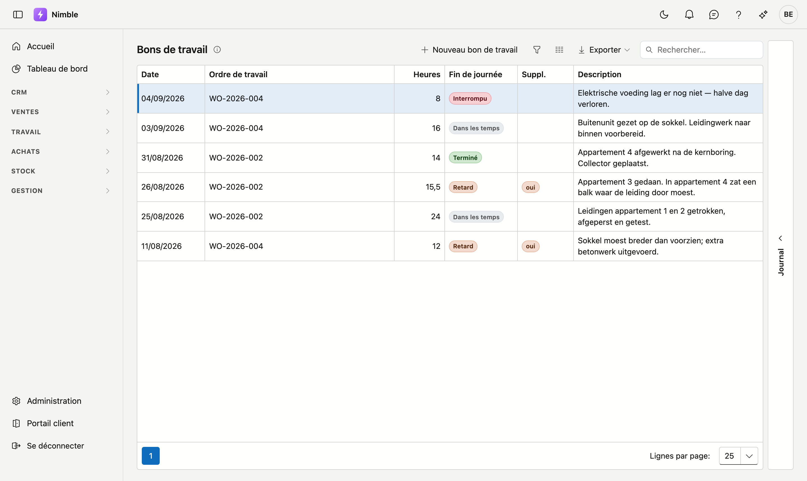
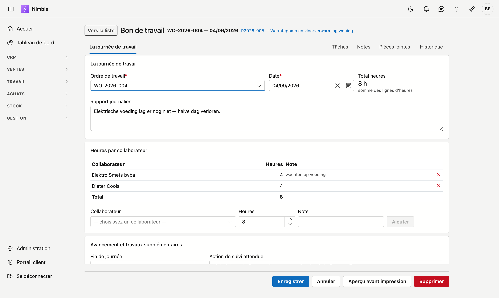

# Bons de travail

Un bon de travail correspond à **une journée de travail sur un ordre de travail** : qui était présent,
combien d'heures, ce qui a été consommé et comment la journée s'est terminée. Tout ce qui suit — calcul a
posteriori, facturation des travaux supplémentaires, productivité — se base sur cette fiche.

## Ouvrir l'écran

Cliquez dans la barre latérale sur **Travail → Bons de travail**. Vous y accédez également par le bouton
**Ajouter un bon de travail** sur un ordre de travail ; le bon est alors immédiatement rattaché à cet
ordre.

## La liste

| Colonne | Ce que c'est |
|---|---|
| **Date** | La journée de travail |
| **Ordre de travail** | La mission dont relève cette journée |
| **Heures** | Le total de tous les collaborateurs ce jour-là |
| **Fin de journée** | Dans les temps · En retard · Interrompu · Terminé |
| **Travaux supplémentaires** | N'apparaît que si l'équipe a constaté du travail en plus |
| **Description** | Le rapport de journée en bref |

À droite se trouve le tiroir **Journal**, pour le bon sur lequel se trouve votre curseur : tâches, notes,
pièces jointes et historique sans ouvrir la fiche.

## La fiche

En haut figurent le numéro de l'ordre de travail et la date, et à côté un lien vers le **projet** dont
relève cet ordre.

### La journée de travail

| Champ | Remarque |
|---|---|
| **Ordre de travail** | Obligatoire. Ce dont relève cette journée |
| **Date** | Obligatoire |
| **Total des heures** | Se base sur les lignes d'heures ci-dessous dès qu'il y en a — vous ne saisissez alors rien |
| **Rapport de journée** | Ce qui s'est passé ce jour-là, en langage courant |

### Heures par collaborateur

Ajoutez une ligne par collaborateur avec le nombre d'heures et éventuellement une note. Le **Total** en bas
est la somme, et c'est aussi le total du bon de travail.

Ces heures sont la source du calcul a posteriori sur le projet : elles sont multipliées par le **coût
horaire interne** du collaborateur.

### Avancement et travaux supplémentaires

**Fin de journée** indique où en est le travail :

| Valeur | Ce que cela signifie |
|---|---|
| **Dans les temps** | Le travail du jour est fait ; l'équipe revient comme prévu |
| **En retard** | On a travaillé, mais cela prend du retard — plus de jours que prévu |
| **Interrompu** | Le chantier est à l'arrêt : météo, matériaux, accès, une décision du client |
| **Terminé** | Tout est prêt ; le chantier peut être réceptionné |

**Action de suivi attendue** est ce qui doit se passer demain. Remplissez-la en cas de retard ou
d'interruption — c'est ce que l'équipe suivante lit en premier.

**Des travaux supplémentaires ont été constatés** est un indicateur distinct, pas une phrase dans le
rapport de journée. Les travaux supplémentaires doivent encore être approuvés et facturés, et personne ne
retrouve cela dans un pavé de texte. Si vous cochez la case, l'écran demande de quoi il s'agit.

### Matériel consommé

Le matériel a été déduit du stock à la **création** du bon. Vous ne pouvez donc plus le modifier ici.

!!! warning "Le matériel ne se corrige pas après coup sur le bon"
    Le stock a déjà bougé. Si quelque chose ne va pas, corrigez-le par un mouvement de stock distinct plutôt
    que de modifier le bon — sinon votre bon de travail et votre stock divergent.

## Faire signer la feuille

L'**Aperçu avant impression** vous donne le bon sous forme de document : la feuille que l'équipe fait
signer sur le chantier. Le nom du fichier reprend le numéro de l'ordre de travail et la date.

Cela ne fonctionne que sur un bon **enregistré** — un brouillon n'a pas encore de numéro ni de contenu
figé.
