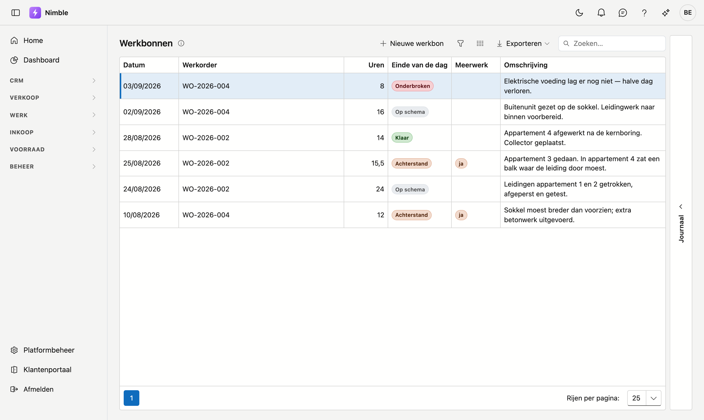
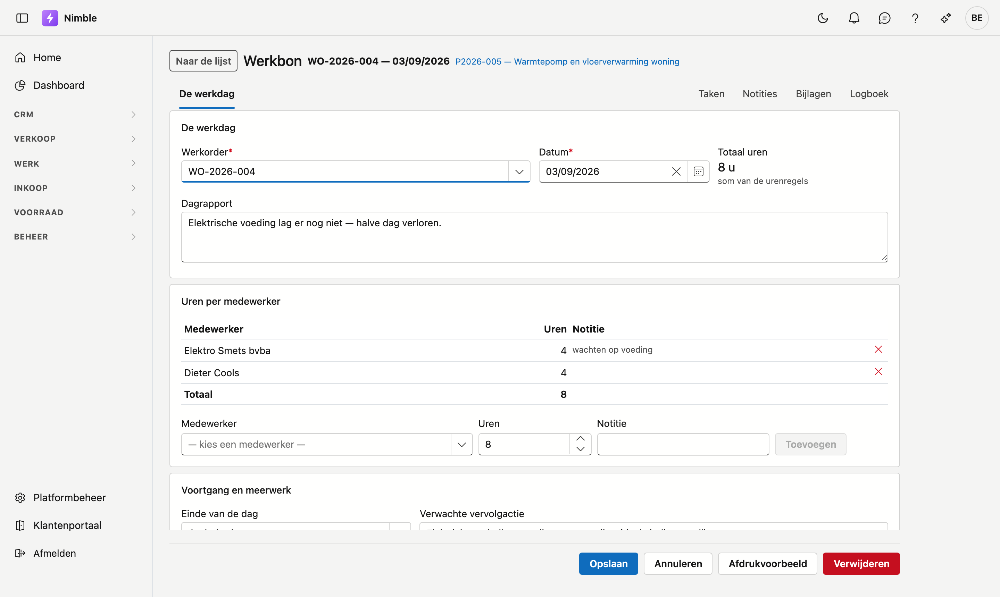

# Werkbonnen

Een werkbon is **één werkdag op één werkorder**: wie er stond, hoeveel uur, wat er verbruikt is en hoe de
dag geëindigd is. Alles wat later gebeurt — nacalculatie, meerwerk factureren, productiviteit — leest van
dit blad.

## Het scherm openen

Klik in de zijbalk op **Werk → Werkbonnen**. U komt er ook via de knop **Werkbon toevoegen** op een
werkorder; de bon hangt dan meteen aan die werkorder.

## De lijst

| Kolom | Wat het is |
|---|---|
| **Datum** | De werkdag |
| **Werkorder** | De opdracht waar deze dag onder valt |
| **Uren** | Het totaal van alle medewerkers op die dag |
| **Einde van de dag** | Op schema · Achterstand · Onderbroken · Klaar |
| **Meerwerk** | Staat er alleen wanneer de ploeg extra werk vastgesteld heeft |
| **Omschrijving** | Het dagrapport in het kort |

Rechts zit de lade **Journaal**, bij de werkbon waarop uw cursor staat: taken, notities, bijlagen en
logboek zonder de fiche te openen.

## De fiche

Bovenaan staat het werkordernummer met de datum, en daarnaast een link naar het **project** waar die
werkorder onder valt.

### De werkdag

| Veld | Opmerking |
|---|---|
| **Werkorder** | Verplicht. Waar deze dag onder valt |
| **Datum** | Verplicht |
| **Totaal uren** | Leest van de urenregels hieronder zodra die er zijn — u vult dan niets in |
| **Dagrapport** | Wat er die dag gebeurd is, in gewone taal |

### Uren per medewerker

Voeg per medewerker een regel toe met het aantal uren en eventueel een notitie. Het **Totaal** onderaan is
de som, en dat is meteen het totaal van de werkbon.

Deze uren zijn de bron van de nacalculatie op het project: ze worden vermenigvuldigd met de **interne
uurkost** van de medewerker.

### Voortgang en meerwerk

**Einde van de dag** zegt hoe het werk ervoor staat:

| Waarde | Wat het betekent |
|---|---|
| **Op schema** | Het werk van vandaag is af; de ploeg komt terug zoals gepland |
| **Achterstand** | Er is gewerkt, maar het loopt achter — meer dagen nodig dan voorzien |
| **Onderbroken** | De werf ligt stil: weer, materiaal, toegang, een beslissing van de klant |
| **Klaar** | Alles is klaar; de werf kan opgeleverd worden |

**Verwachte vervolgactie** is wat er morgen moet gebeuren. Vul dat in bij achterstand of onderbreking —
het is wat de volgende ploeg als eerste leest.

**Er is meerwerk vastgesteld** is een aparte vlag, geen zin in het dagrapport. Meerwerk moet nog
goedgekeurd en gefactureerd worden, en niemand vindt dat terug in een lap tekst. Vinkt u het aan, dan
vraagt het scherm wát het meerwerk is.

### Verbruikt materiaal

Het materiaal is bij het **aanmaken** van de werkbon van de voorraad afgeboekt. U kan het hier daarom niet
meer wijzigen.

!!! warning "Materiaal wijzigt u niet achteraf op de bon"
    De voorraad is al bewogen. Klopt er iets niet, corrigeer dat dan als een aparte voorraadbeweging in
    plaats van de bon aan te passen — anders lopen uw werkbon en uw voorraad uit elkaar.

## Het blad laten aftekenen

**Afdrukvoorbeeld** geeft u de werkbon als document: het blad dat de ploeg op de werf laat aftekenen. De
bestandsnaam draagt het werkordernummer en de datum.

Dat werkt alleen op een **bewaarde** bon — een klad heeft nog geen nummer en geen vaste inhoud.
